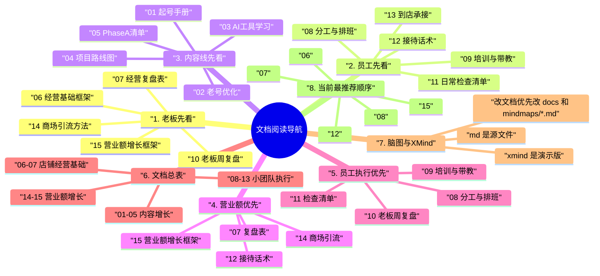

# 小黑托昵文档阅读导航 Mindmap

```mermaid
mindmap
  root(("文档阅读导航"))
    "1. 老板先看"
      "06 经营基础框架"
      "15 营业额增长框架"
      "14 商场引流方法"
      "07 经营复盘表"
      "10 老板周复盘"
    "2. 员工先看"
      "08 分工与排班"
      "09 培训与带教"
      "11 日常检查清单"
      "12 接待话术"
      "13 到店承接"
    "3. 内容线先看"
      "01 起号手册"
      "02 老号优化"
      "03 AI工具学习"
      "04 项目路线图"
      "05 PhaseA清单"
    "4. 营业额优先"
      "15 营业额增长框架"
      "14 商场引流"
      "12 接待话术"
      "07 复盘表"
    "5. 员工执行优先"
      "08 分工与排班"
      "09 培训与带教"
      "11 检查清单"
      "10 老板周复盘"
    "6. 文档总表"
      "01-05 内容增长"
      "06-07 店铺经营基础"
      "08-13 小团队执行"
      "14-15 营业额增长"
    "7. 脑图与XMind"
      "md 是源文件"
      "xmind 是演示版"
      "改文档优先改 docs 和 mindmaps/*.md"
    "8. 当前最推荐顺序"
      "06"
      "15"
      "08"
      "12"
      "07"
```
