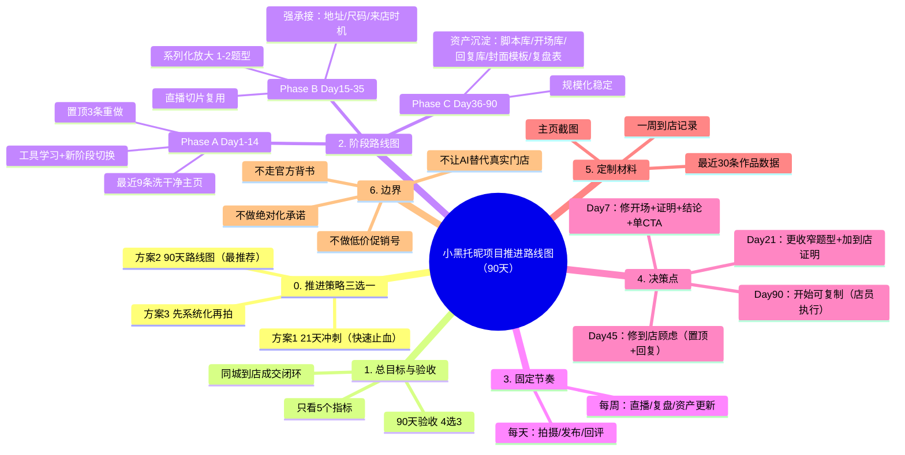

# 小黑托昵项目推进路线图 Mindmap（90 天）

```mermaid
mindmap
  root((小黑托昵项目推进路线图（90天）))
    0. 推进策略三选一
      方案1 21天冲刺（快速止血）
      方案2 90天路线图（最推荐）
      方案3 先系统化再拍
    1. 总目标与验收
      同城到店成交闭环
      90天验收 4选3
      只看5个指标
    2. 阶段路线图
      Phase A Day1-14
        工具学习+新阶段切换
        置顶3条重做
        最近9条洗干净主页
      Phase B Day15-35
        系列化放大 1-2题型
        强承接：地址/尺码/来店时机
        直播切片复用
      Phase C Day36-90
        规模化稳定
        资产沉淀：脚本库/开场库/回复库/封面模板/复盘表
    3. 固定节奏
      每天：拍摄/发布/回评
      每周：直播/复盘/资产更新
    4. 决策点
      Day7：修开场+证明+结论+单CTA
      Day21：更收窄题型+加到店证明
      Day45：修到店顾虑（置顶+回复）
      Day90：开始可复制（店员执行）
    5. 定制材料
      最近30条作品数据
      主页截图
      一周到店记录
    6. 边界
      不走官方背书
      不做绝对化承诺
      不做低价促销号
      不让AI替代真实门店
```