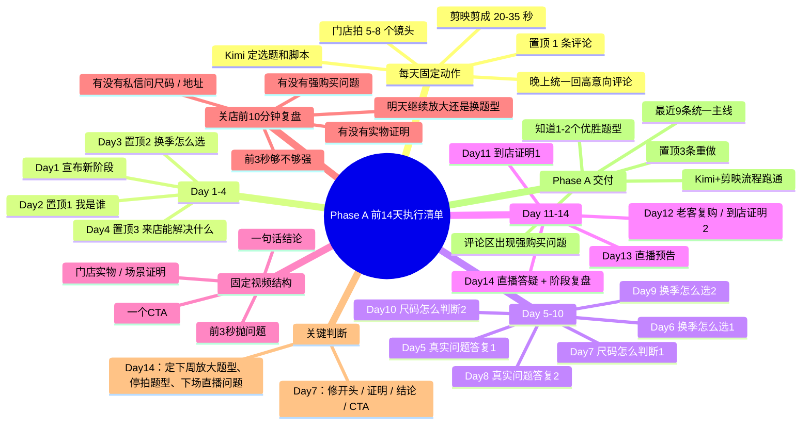

# 小黑托昵 Phase A 前14天执行清单 Mindmap

```mermaid
mindmap
  root((Phase A 前14天执行清单))
    每天固定动作
      Kimi 定选题和脚本
      门店拍 5-8 个镜头
      剪映剪成 20-35 秒
      置顶 1 条评论
      晚上统一回高意向评论
    Day 1-4
      Day1 宣布新阶段
      Day2 置顶1 我是谁
      Day3 置顶2 换季怎么选
      Day4 置顶3 来店能解决什么
    Day 5-10
      Day5 真实问题答复1
      Day6 换季怎么选1
      Day7 尺码怎么判断1
      Day8 真实问题答复2
      Day9 换季怎么选2
      Day10 尺码怎么判断2
    Day 11-14
      Day11 到店证明1
      Day12 老客复购 / 到店证明2
      Day13 直播预告
      Day14 直播答疑 + 阶段复盘
    固定视频结构
      前3秒抛问题
      门店实物 / 场景证明
      一句话结论
      一个CTA
    关店前10分钟复盘
      有没有强购买问题
      有没有私信问尺码 / 地址
      前3秒够不够强
      有没有实物证明
      明天继续放大还是换题型
    关键判断
      Day7：修开头 / 证明 / 结论 / CTA
      Day14：定下周放大题型、停拍题型、下场直播问题
    Phase A 交付
      置顶3条重做
      最近9条统一主线
      知道1-2个优胜题型
      Kimi+剪映流程跑通
      评论区出现强购买问题
```