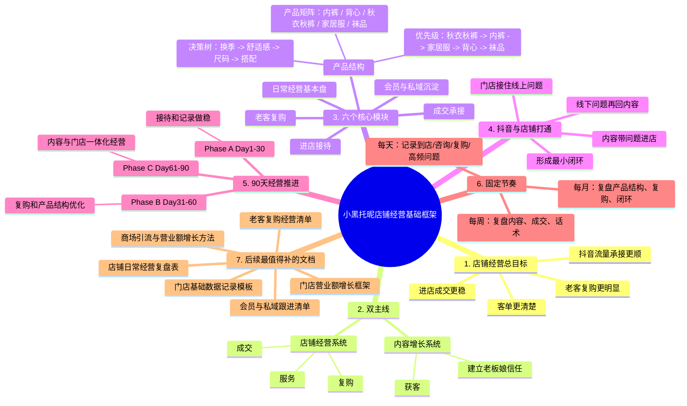

# 小黑托昵店铺经营基础框架 Mindmap

```mermaid
mindmap
  root((小黑托昵店铺经营基础框架))
    1. 店铺经营总目标
      进店成交更稳
      客单更清楚
      老客复购更明显
      抖音流量承接更顺
    2. 双主线
      内容增长系统
        获客
        建立老板娘信任
      店铺经营系统
        成交
        服务
        复购
    3. 六个核心模块
      进店接待
      产品结构
        产品矩阵：内裤 / 背心 / 秋衣秋裤 / 家居服 / 袜品
        优先级：秋衣秋裤 -> 内裤 -> 家居服 -> 背心 -> 袜品
        决策树：换季 -> 舒适感 -> 尺码 -> 搭配
      成交承接
      老客复购
      会员与私域沉淀
      日常经营基本盘
    4. 抖音与店铺打通
      内容带问题进店
      门店接住线上问题
      线下问题再回内容
      形成最小闭环
    5. 90天经营推进
      Phase A Day1-30
        接待和记录做稳
      Phase B Day31-60
        复购和产品结构优化
      Phase C Day61-90
        内容与门店一体化经营
    6. 固定节奏
      每天：记录到店/咨询/复购/高频问题
      每周：复盘内容、成交、话术
      每月：复盘产品结构、复购、闭环
    7. 后续最值得补的文档
      店铺日常经营复盘表
      商场引流与营业额增长方法
      门店营业额增长框架
      老客复购经营清单
      会员与私域跟进清单
      门店基础数据记录模板
```