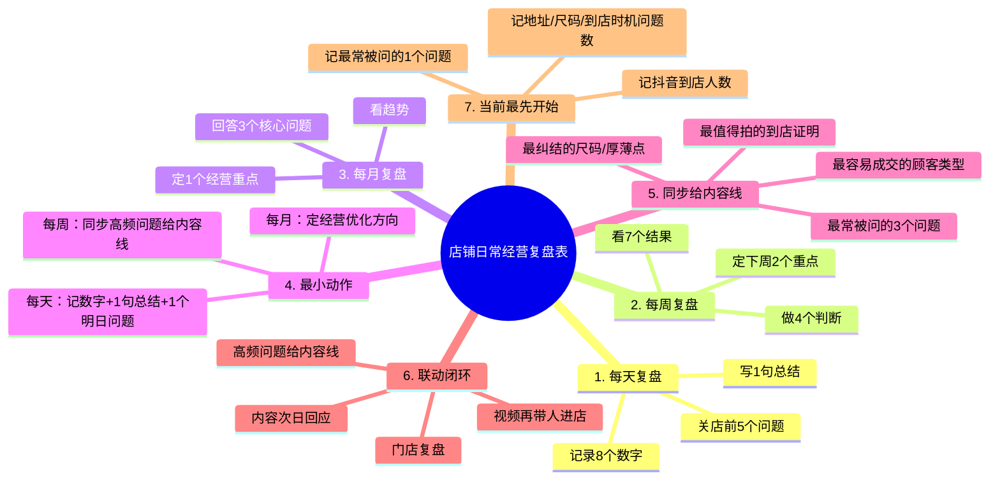

# 小黑托昵店铺日常经营复盘表 Mindmap

```mermaid
mindmap
  root((店铺日常经营复盘表))
    1. 每天复盘
      记录8个数字
      关店前5个问题
      写1句总结
    2. 每周复盘
      看7个结果
      做4个判断
      定下周2个重点
    3. 每月复盘
      看趋势
      回答3个核心问题
      定1个经营重点
    4. 最小动作
      每天：记数字+1句总结+1个明日问题
      每周：同步高频问题给内容线
      每月：定经营优化方向
    5. 同步给内容线
      最常被问的3个问题
      最容易成交的顾客类型
      最纠结的尺码/厚薄点
      最值得拍的到店证明
    6. 联动闭环
      门店复盘
      高频问题给内容线
      内容次日回应
      视频再带人进店
    7. 当前最先开始
      记抖音到店人数
      记地址/尺码/到店时机问题数
      记最常被问的1个问题
```