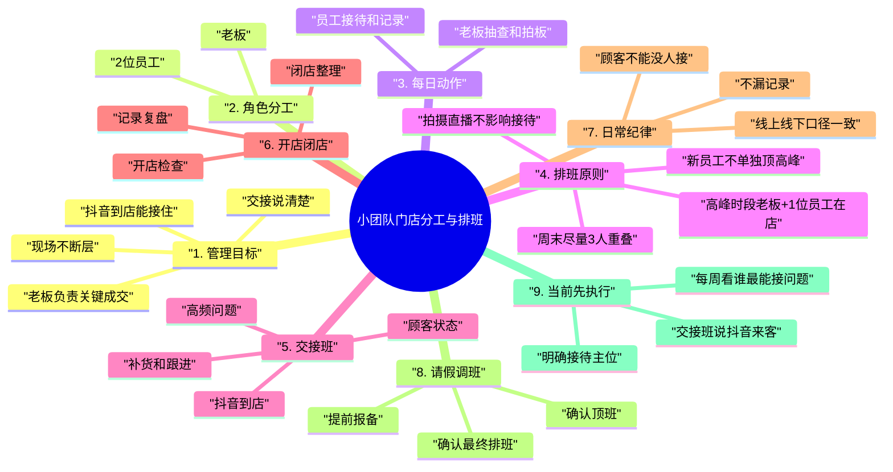

# 小黑托昵小团队门店分工与排班手册 Mindmap

```mermaid
mindmap
  root(("小团队门店分工与排班"))
    "1. 管理目标"
      "现场不断层"
      "老板负责关键成交"
      "抖音到店能接住"
      "交接说清楚"
    "2. 角色分工"
      "老板"
      "2位员工"
    "3. 每日动作"
      "老板抽查和拍板"
      "员工接待和记录"
    "4. 排班原则"
      "高峰时段老板+1位员工在店"
      "周末尽量3人重叠"
      "拍摄直播不影响接待"
      "新员工不单独顶高峰"
    "5. 交接班"
      "顾客状态"
      "抖音到店"
      "高频问题"
      "补货和跟进"
    "6. 开店闭店"
      "开店检查"
      "闭店整理"
      "记录复盘"
    "7. 日常纪律"
      "顾客不能没人接"
      "线上线下口径一致"
      "不漏记录"
    "8. 请假调班"
      "提前报备"
      "确认顶班"
      "确认最终排班"
    "9. 当前先执行"
      "明确接待主位"
      "交接班说抖音来客"
      "每周看谁最能接问题"
```
