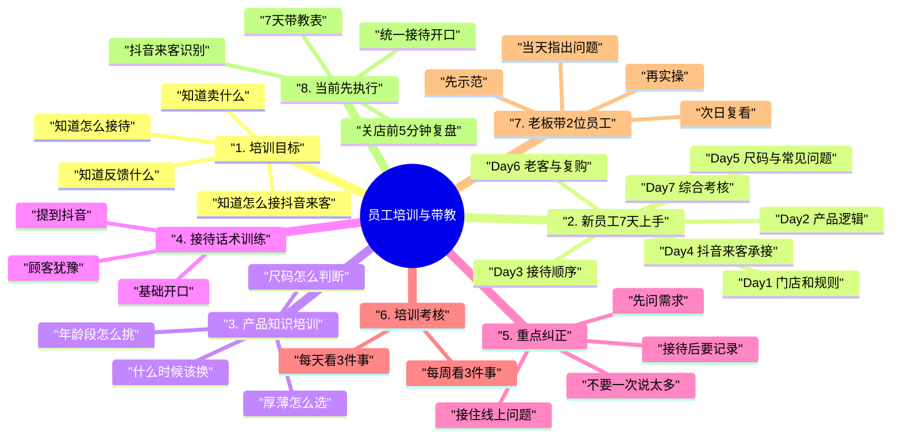

# 小黑托昵员工培训与带教SOP Mindmap

```mermaid
mindmap
  root(("员工培训与带教"))
    "1. 培训目标"
      "知道卖什么"
      "知道怎么接待"
      "知道怎么接抖音来客"
      "知道反馈什么"
    "2. 新员工7天上手"
      "Day1 门店和规则"
      "Day2 产品逻辑"
      "Day3 接待顺序"
      "Day4 抖音来客承接"
      "Day5 尺码与常见问题"
      "Day6 老客与复购"
      "Day7 综合考核"
    "3. 产品知识培训"
      "什么时候该换"
      "厚薄怎么选"
      "年龄段怎么挑"
      "尺码怎么判断"
    "4. 接待话术训练"
      "基础开口"
      "顾客犹豫"
      "提到抖音"
    "5. 重点纠正"
      "先问需求"
      "不要一次说太多"
      "接住线上问题"
      "接待后要记录"
    "6. 培训考核"
      "每天看3件事"
      "每周看3件事"
    "7. 老板带2位员工"
      "先示范"
      "再实操"
      "当天指出问题"
      "次日复看"
    "8. 当前先执行"
      "7天带教表"
      "统一接待开口"
      "抖音来客识别"
      "关店前5分钟复盘"
```
