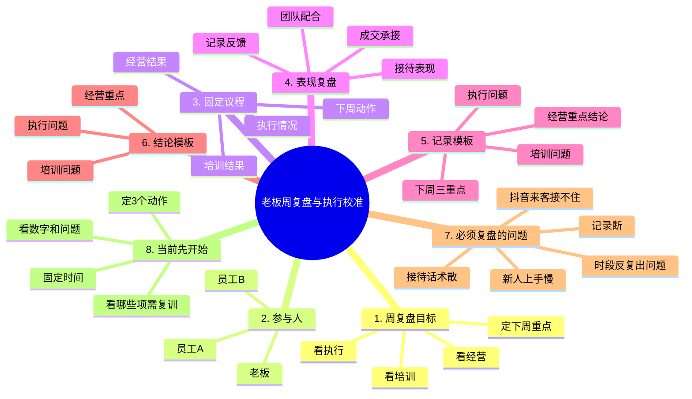

# 小黑托昵老板周复盘与执行校准 Mindmap

```mermaid
mindmap
  root((老板周复盘与执行校准))
    1. 周复盘目标
      看经营
      看执行
      看培训
      定下周重点
    2. 参与人
      老板
      员工A
      员工B
    3. 固定议程
      经营结果
      执行情况
      培训结果
      下周动作
    4. 表现复盘
      接待表现
      成交承接
      记录反馈
      团队配合
    5. 记录模板
      经营重点结论
      执行问题
      培训问题
      下周三重点
    6. 结论模板
      经营重点
      执行问题
      培训问题
    7. 必须复盘的问题
      抖音来客接不住
      时段反复出问题
      新人上手慢
      接待话术散
      记录断
    8. 当前先开始
      固定时间
      看数字和问题
      看哪些项需复训
      定3个动作
```