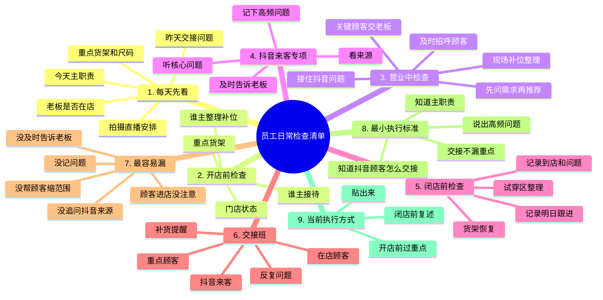

# 小黑托昵员工日常检查清单 Mindmap

```mermaid
mindmap
  root((员工日常检查清单))
    1. 每天先看
      今天主职责
      老板是否在店
      拍摄直播安排
      重点货架和尺码
      昨天交接问题
    2. 开店前检查
      门店状态
      重点货架
      谁主接待
      谁主整理补位
    3. 营业中检查
      及时招呼顾客
      先问需求再推荐
      接住抖音问题
      关键顾客交老板
      现场补位整理
    4. 抖音来客专项
      看来源
      听核心问题
      及时告诉老板
      记下高频问题
    5. 闭店前检查
      货架恢复
      试穿区整理
      记录到店和问题
      记录明日跟进
    6. 交接班
      在店顾客
      抖音来客
      反复问题
      补货提醒
      重点顾客
    7. 最容易漏
      没追问抖音来源
      没帮顾客缩范围
      没记问题
      顾客进店没注意
      没及时告诉老板
    8. 最小执行标准
      知道主职责
      知道抖音顾客怎么交接
      说出高频问题
      交接不漏重点
    9. 当前执行方式
      贴出来
      开店前过重点
      闭店前复述
```