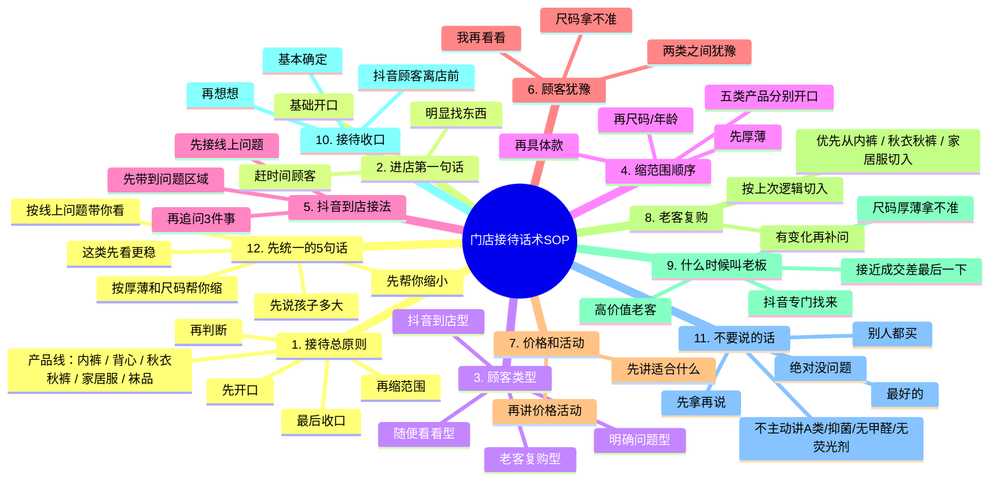

# 小黑托昵门店接待话术SOP Mindmap

```mermaid
mindmap
  root((门店接待话术SOP))
    1. 接待总原则
      先开口
      再判断
      再缩范围
      最后收口
      产品线：内裤 / 背心 / 秋衣秋裤 / 家居服 / 袜品
    2. 进店第一句话
      基础开口
      明显找东西
      赶时间顾客
    3. 顾客类型
      随便看看型
      明确问题型
      抖音到店型
      老客复购型
    4. 缩范围顺序
      先厚薄
      再尺码/年龄
      再具体款
      五类产品分别开口
    5. 抖音到店接法
      先接线上问题
      再追问3件事
      先带到问题区域
    6. 顾客犹豫
      我再看看
      两类之间犹豫
      尺码拿不准
    7. 价格和活动
      先讲适合什么
      再讲价格活动
    8. 老客复购
      按上次逻辑切入
      有变化再补问
      优先从内裤 / 秋衣秋裤 / 家居服切入
    9. 什么时候叫老板
      抖音专门找来
      高价值老客
      尺码厚薄拿不准
      接近成交差最后一下
    10. 接待收口
      再想想
      基本确定
      抖音顾客离店前
    11. 不要说的话
      最好的
      别人都买
      绝对没问题
      先拿再说
      不主动讲A类/抑菌/无甲醛/无荧光剂
    12. 先统一的5句话
      按厚薄和尺码帮你缩
      先说孩子多大
      按线上问题带你看
      先帮你缩小
      这类先看更稳
```