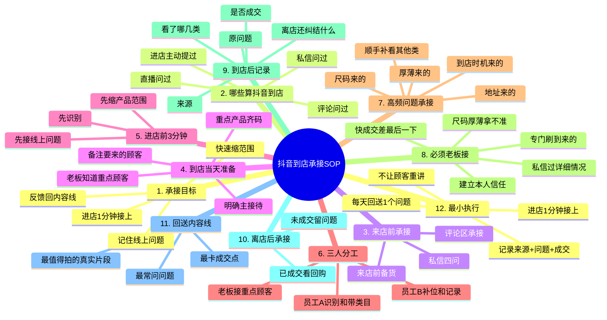

# 小黑托昵抖音到店承接SOP Mindmap

```mermaid
mindmap
  root((抖音到店承接SOP))
    1. 承接目标
      记住线上问题
      进店1分钟接上
      快速缩范围
      反馈回内容线
    2. 哪些算抖音到店
      评论问过
      私信问过
      直播问过
      进店主动提过
    3. 来店前承接
      评论区承接
      私信四问
      来店前备货
    4. 到店当天准备
      重点产品齐码
      备注要来的顾客
      明确主接待
      老板知道重点顾客
    5. 进店前3分钟
      先识别
      先接线上问题
      先缩产品范围
    6. 三人分工
      老板接重点顾客
      员工A识别和带类目
      员工B补位和记录
    7. 高频问题承接
      地址来的
      尺码来的
      厚薄来的
      到店时机来的
      顺手补看其他类
    8. 必须老板接
      专门刷到来的
      私信过详细情况
      建立本人信任
      尺码厚薄拿不准
      快成交差最后一下
    9. 到店后记录
      来源
      原问题
      看了哪几类
      是否成交
      离店还纠结什么
    10. 离店后承接
      已成交看回购
      未成交留问题
    11. 回送内容线
      最常问问题
      最卡成交点
      最值得拍的真实片段
    12. 最小执行
      进店1分钟接上
      不让顾客重讲
      记录来源+问题+成交
      每天回送1个问题
```