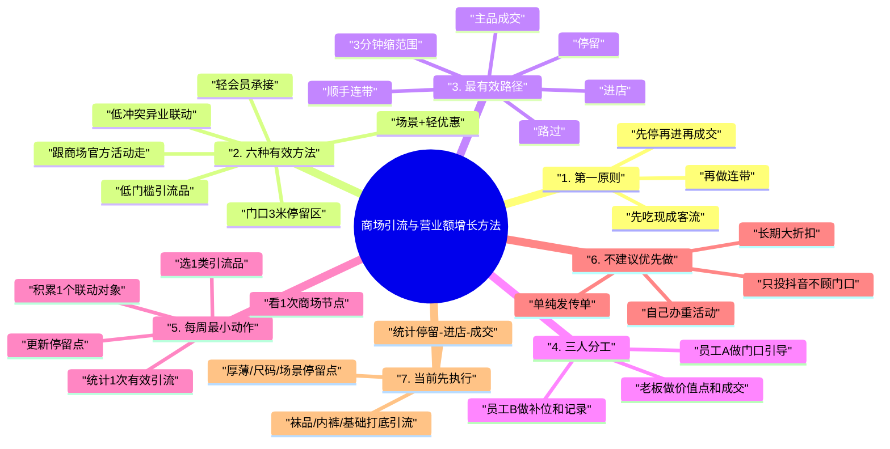

# 小黑托昵商场引流与营业额增长方法 Mindmap

```mermaid
mindmap
  root(("商场引流与营业额增长方法"))
    "1. 第一原则"
      "先吃现成客流"
      "先停再进再成交"
      "再做连带"
    "2. 六种有效方法"
      "跟商场官方活动走"
      "门口3米停留区"
      "低门槛引流品"
      "低冲突异业联动"
      "轻会员承接"
      "场景+轻优惠"
    "3. 最有效路径"
      "路过"
      "停留"
      "进店"
      "3分钟缩范围"
      "主品成交"
      "顺手连带"
    "4. 三人分工"
      "老板做价值点和成交"
      "员工A做门口引导"
      "员工B做补位和记录"
    "5. 每周最小动作"
      "更新停留点"
      "选1类引流品"
      "看1次商场节点"
      "积累1个联动对象"
      "统计1次有效引流"
    "6. 不建议优先做"
      "长期大折扣"
      "单纯发传单"
      "自己办重活动"
      "只投抖音不顾门口"
    "7. 当前先执行"
      "厚薄/尺码/场景停留点"
      "袜品/内裤/基础打底引流"
      "统计停留-进店-成交"
```
