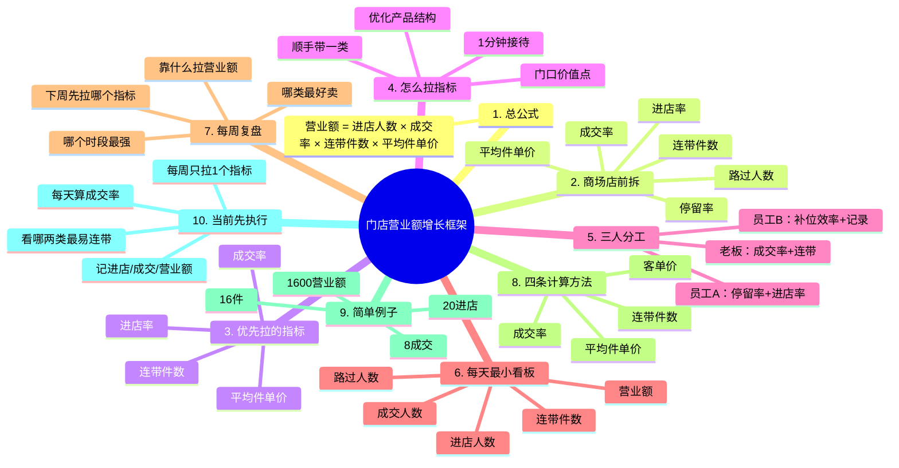

# 小黑托昵门店营业额增长框架 Mindmap

```mermaid
mindmap
  root((门店营业额增长框架))
    1. 总公式
      营业额 = 进店人数 × 成交率 × 连带件数 × 平均件单价
    2. 商场店前拆
      路过人数
      停留率
      进店率
      成交率
      连带件数
      平均件单价
    3. 优先拉的指标
      进店率
      成交率
      连带件数
      平均件单价
    4. 怎么拉指标
      门口价值点
      1分钟接待
      顺手带一类
      优化产品结构
    5. 三人分工
      老板：成交率+连带
      员工A：停留率+进店率
      员工B：补位效率+记录
    6. 每天最小看板
      路过人数
      进店人数
      成交人数
      连带件数
      营业额
    7. 每周复盘
      靠什么拉营业额
      哪类最好卖
      哪个时段最强
      下周先拉哪个指标
    8. 四条计算方法
      成交率
      连带件数
      平均件单价
      客单价
    9. 简单例子
      20进店
      8成交
      16件
      1600营业额
    10. 当前先执行
      记进店/成交/营业额
      每天算成交率
      看哪两类最易连带
      每周只拉1个指标
```