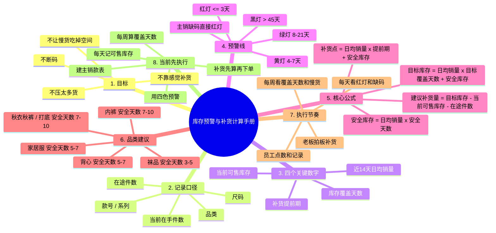

# 小黑托昵库存预警与补货计算手册 Mindmap

```mermaid
mindmap
  root((库存预警与补货计算手册))
    1. 目标
      不断码
      不压太多货
      不靠感觉补货
      不让慢货吃掉空间
    2. 记录口径
      品类
      款号 / 系列
      尺码
      当前在手件数
      在途件数
    3. 四个关键数字
      当前可售库存
      近14天日均销量
      库存覆盖天数
      补货提前期
    4. 预警线
      红灯 <= 3天
      黄灯 4-7天
      绿灯 8-21天
      黑灯 > 45天
      主销缺码直接红灯
    5. 核心公式
      安全库存 = 日均销量 x 安全天数
      补货点 = 日均销量 x 提前期 + 安全库存
      目标库存 = 日均销量 x 目标覆盖天数 + 安全库存
      建议补货量 = 目标库存 - 当前可售库存 - 在途件数
    6. 品类建议
      秋衣秋裤 / 打底 安全天数 7-10
      内裤 安全天数 7-10
      家居服 安全天数 5-7
      背心 安全天数 5-7
      袜品 安全天数 3-5
    7. 执行节奏
      每天看红灯和缺码
      每周看覆盖天数和慢货
      老板拍板补货
      员工点数和记录
    8. 当前先执行
      建主销款表
      每天记可售库存
      每周算覆盖天数
      用四色预警
      补货先算再下单
```
