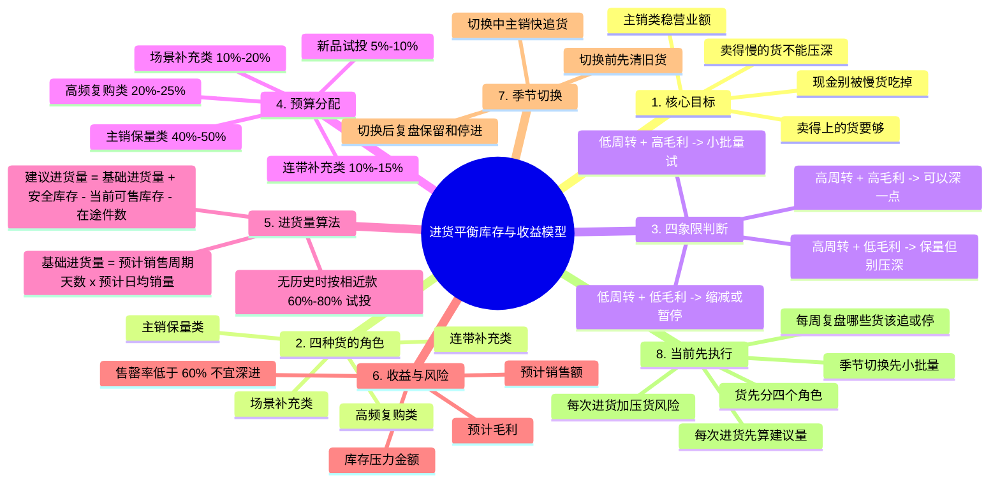

# 小黑托昵进货平衡库存与收益模型 Mindmap

```mermaid
mindmap
  root((进货平衡库存与收益模型))
    1. 核心目标
      卖得上的货要够
      卖得慢的货不能压深
      主销类稳营业额
      现金别被慢货吃掉
    2. 四种货的角色
      主销保量类
      高频复购类
      场景补充类
      连带补充类
    3. 四象限判断
      高周转 + 高毛利 -> 可以深一点
      高周转 + 低毛利 -> 保量但别压深
      低周转 + 高毛利 -> 小批量试
      低周转 + 低毛利 -> 缩减或暂停
    4. 预算分配
      主销保量类 40%-50%
      高频复购类 20%-25%
      场景补充类 10%-20%
      连带补充类 10%-15%
      新品试投 5%-10%
    5. 进货量算法
      基础进货量 = 预计销售周期天数 x 预计日均销量
      建议进货量 = 基础进货量 + 安全库存 - 当前可售库存 - 在途件数
      无历史时按相近款 60%-80% 试投
    6. 收益与风险
      预计销售额
      预计毛利
      库存压力金额
      售罄率低于 60% 不宜深进
    7. 季节切换
      切换前先清旧货
      切换中主销快追货
      切换后复盘保留和停进
    8. 当前先执行
      货先分四个角色
      每次进货先算建议量
      每次进货加压货风险
      季节切换先小批量
      每周复盘哪些货该追或停
```
