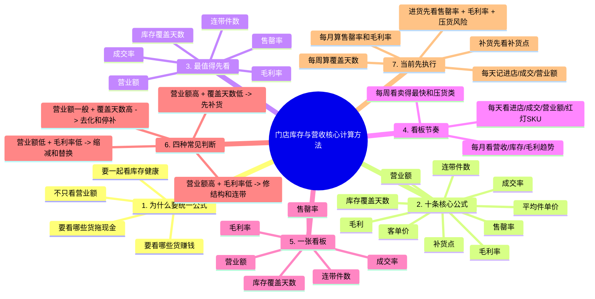

# 小黑托昵门店库存与营收核心计算方法 Mindmap

```mermaid
mindmap
  root((门店库存与营收核心计算方法))
    1. 为什么要统一公式
      不只看营业额
      要一起看库存健康
      要看哪些货赚钱
      要看哪些货拖现金
    2. 十条核心公式
      营业额
      成交率
      连带件数
      平均件单价
      客单价
      库存覆盖天数
      补货点
      售罄率
      毛利
      毛利率
    3. 最值得先看
      营业额
      成交率
      连带件数
      库存覆盖天数
      售罄率
      毛利率
    4. 看板节奏
      每天看进店/成交/营业额/红灯SKU
      每周看卖得最快和压货类
      每月看营收/库存/毛利趋势
    5. 一张看板
      营业额
      成交率
      连带件数
      库存覆盖天数
      售罄率
      毛利率
    6. 四种常见判断
      营业额高 + 覆盖天数低 -> 先补货
      营业额一般 + 覆盖天数高 -> 去化和停补
      营业额高 + 毛利率低 -> 修结构和连带
      营业额低 + 毛利率低 -> 缩减和替换
    7. 当前先执行
      每天记进店/成交/营业额
      每周算覆盖天数
      每月算售罄率和毛利率
      补货先看补货点
      进货先看售罄率 + 毛利率 + 压货风险
```
