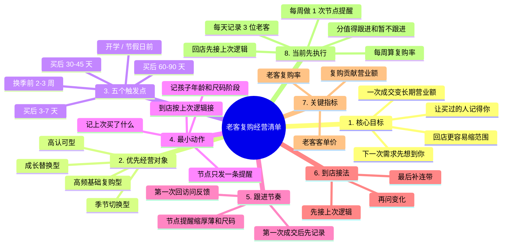

# 小黑托昵老客复购经营清单 Mindmap

```mermaid
mindmap
  root((老客复购经营清单))
    1. 核心目标
      让买过的人记得你
      下一次需求先想到你
      回店更容易缩范围
      一次成交变长期营业额
    2. 优先经营对象
      高频基础复购型
      季节切换型
      成长替换型
      高认可型
    3. 五个触发点
      买后 3-7 天
      买后 30-45 天
      买后 60-90 天
      换季前 2-3 周
      开学 / 节假日前
    4. 最小动作
      记上次买了什么
      记孩子年龄和尺码阶段
      节点只发一条提醒
      到店按上次逻辑接
    5. 跟进节奏
      第一次成交后先记录
      第一次回访问反馈
      节点提醒缩厚薄和尺码
    6. 到店接法
      先接上次逻辑
      再问变化
      最后补连带
    7. 关键指标
      复购贡献营业额
      老客复购率
      老客客单价
    8. 当前先执行
      分值得跟进和暂不跟进
      每天记录 3 位老客
      每周做 1 次节点提醒
      回店先接上次逻辑
      每周算复购率
```
