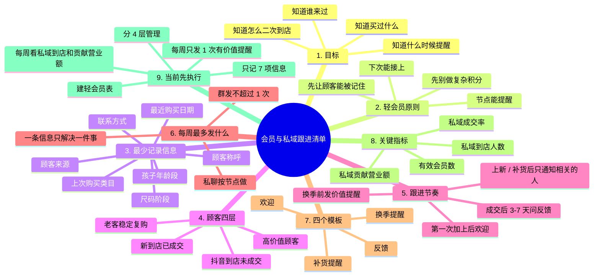

# 小黑托昵会员与私域跟进清单 Mindmap

```mermaid
mindmap
  root((会员与私域跟进清单))
    1. 目标
      知道谁来过
      知道买过什么
      知道什么时候提醒
      知道怎么二次到店
    2. 轻会员原则
      先别做复杂积分
      先让顾客能被记住
      下次能接上
      节点能提醒
    3. 最少记录信息
      顾客称呼
      联系方式
      孩子年龄段
      尺码阶段
      上次购买类目
      最近购买日期
      顾客来源
    4. 顾客四层
      新到店已成交
      老客稳定复购
      抖音到店未成交
      高价值顾客
    5. 跟进节奏
      第一次加上后欢迎
      成交后 3-7 天问反馈
      换季前发价值提醒
      上新 / 补货后只通知相关的人
    6. 每周最多发什么
      群发不超过 1 次
      私聊按节点做
      一条信息只解决一件事
    7. 四个模板
      欢迎
      反馈
      换季提醒
      补货提醒
    8. 关键指标
      私域到店人数
      私域成交率
      私域贡献营业额
      有效会员数
    9. 当前先执行
      建轻会员表
      只记 7 项信息
      分 4 层管理
      每周只发 1 次有价值提醒
      每周看私域到店和贡献营业额
```
