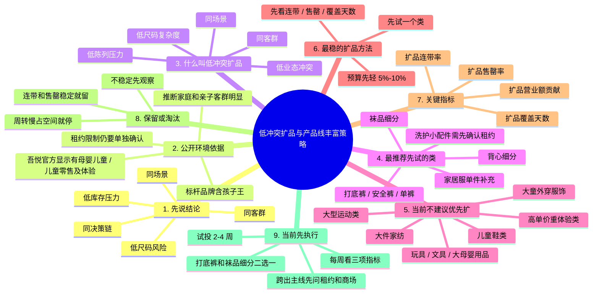

# 小黑托昵低冲突扩品与产品线丰富策略 Mindmap

```mermaid
mindmap
  root((低冲突扩品与产品线丰富策略))
    1. 先说结论
      同客群
      同场景
      同决策链
      低尺码风险
      低库存压力
    2. 公开环境依据
      吾悦官方显示有母婴儿童 / 儿童零售及体验
      标杆品牌含孩子王
      推断家庭和亲子客群明显
      租约限制仍要单独确认
    3. 什么叫低冲突扩品
      同客群
      同场景
      低尺码复杂度
      低陈列压力
      低业态冲突
    4. 最推荐先试的类
      打底裤 / 安全裤 / 单裤
      袜品细分
      背心细分
      家居服单件补充
      洗护小配件需先确认租约
    5. 当前不建议优先扩
      大童外穿服饰
      儿童鞋类
      玩具 / 文具 / 大母婴用品
      大件家纺
      大型运动类
      高单价重体验类
    6. 最稳的扩品方法
      先试一个类
      预算先轻 5%-10%
      先看连带 / 售罄 / 覆盖天数
    7. 关键指标
      扩品连带率
      扩品营业额贡献
      扩品售罄率
      扩品覆盖天数
    8. 保留或淘汰
      连带和售罄稳定就留
      不稳定先观察
      周转慢占空间就停
    9. 当前先执行
      打底裤和袜品细分二选一
      试投 2-4 周
      每周看三项指标
      跨出主线先问租约和商场
```
