<!-- FIELD_AUDIT_SUMMARY:START -->
## 字段核对状态（自动生成）

- 已经：18
- 高度怀疑：5
- 详细字段说明：`/Users/lizhihui/Workspace/Black-Tony/reports/calibration/api_field_audit.md`

> 说明：只有截图和当前 JSON 能 100% 对上的标记为 `已经`；存在缺响应、请求类型不一致、或整屏包含当前 API 未覆盖区域的统一标记为 `高度怀疑`。

| 报表 | 状态 | JSON / 截图结论 | SQLite 落点 |
| --- | --- | --- | --- |
| 零售明细统计 | 已经 | 表格列头、动态尺码列和合计列都能和当前 JSON 的 `retdata[0].Title/Data` 对上，两张截图只是横向拆屏。 | retail_detail_snapshots、size_metric_breakdowns |
| 导购员报表 | 已经 | 截图列头与 `SelPersonSale` 返回字段能逐一对应，付款方式和会员字段也能对上。 | guide_report_summary |
| 店铺零售清单 | 已经 | 四张截图只是同一张明细表的横向切片，`ColumnsList` 与页面列头一致。 | sales_order_lines |
| 销售清单 | 已经 | 三张截图与 `ColumnsList` 一致，是当前主店销售主表。 | sales_order_lines |
| 库存明细统计 | 已经 | 截图和 JSON 的两段动态尺码头、现有库存/零售汇总列都能对齐。 | inventory_detail_snapshots、size_metric_breakdowns |
| 库存零售统计 | 已经 | 三张截图覆盖了同一张表的所有列，`StoU` 和零售合计列能和 JSON 对上。 | inventory_sales_snapshots、size_metric_breakdowns |
| 库存总和分析-按年份季节 | 已经 | 当前 capture-cache 里的 `库存综合分析.json` 请求参数是 `rtype=1`，能和这张“按年份季节”截图对上。 | 当前未单独入 SQLite，仅在字段审计和页面解释时使用。 |
| 库存总和分析-按中分类 | 高度怀疑 | 当前 capture-cache 里只有 `rtype=1` 的 JSON，没有抓到 `rtype=2` 响应，无法和这张“按中分类”截图做 1:1 对照。 | 当前未入 SQLite。 |
| 库存总和分析-按波段 | 高度怀疑 | 当前 capture-cache 里只有 `rtype=1` 的 JSON，没有抓到 `rtype=3` 响应，无法和这张“按波段”截图做 1:1 对照。 | 当前未入 SQLite。 |
| 库存多维分析 | 已经 | 五张截图共同构成一张横向超宽表，`A01~A013` 的尺码列、`AStock` 和 `AMoney` 都能和 JSON 对上。 | 当前未单独入 SQLite。 |
| 进销存统计 | 已经 | 三张截图与 `SelInSalesReport` 返回字段完全对应，数量列和分类维度都能对上。 | stock_flow_snapshots |
| 出入库单据 | 已经 | 页面列头、单据状态和首行值都能和 `SelOutInStockReport` 当前响应对上。 | movement_docs |
| 日进销存 | 高度怀疑 | 截图在，但当前 capture-cache 只有 opened-only，没有请求体和响应体，没法和 JSON 做精确对照。 | 当前无响应，也未入 SQLite。 |
| 会员总和分析 | 已经 | 截图和 `SelVipAnalysisReport` 的会员分析字段能对上，积分、储值、消费频次等字段明确。 | vip_analysis_members |
| 会员消费排行 | 已经 | 两张截图与 `SelVipSaleRank` 返回字段一致，排名、单数、款数、销量、销额和占比都能对上。 | member_sales_rank |
| 储值按店汇总 | 已经 | 截图列头与 `ColumnsList` 一致，门店级储值金额汇总没有歧义。 | 当前未入 SQLite。 |
| 储值卡汇总 | 已经 | 截图和 `ColumnsList` 一致，卡级余额/充值/消费字段都能对应。 | 当前未入 SQLite。 |
| 储值卡明细 | 已经 | 两张截图只是同一张明细表的横向拆屏，发生时间、单号、期初/期末余额与充值字段都能对上。 | 当前未入 SQLite。 |
| 商品销售情况 | 已经 | 两张截图与 `SelSaleReportData` 的字段一致，销量、销额、累销、库存和周度序列字段都在当前响应内。 | product_sales_snapshot |
| 商品品类分析 | 高度怀疑 | 截图页面同时出现了“进货/销售/库存”三段，但当前抓到的 `type=3` JSON 只明显对得上其中的库存区块，不能把三段都当成同一份响应。 | 当前未入 SQLite。 |
| 门店销售月报 | 已经 | 截图表头和 `DeptMonthSalesReport` 的 `PageData.Items` 字段一致；金额脱敏为 `****` 也是后端返回结果，不是对照异常。 | 当前未入 SQLite，仅在 `scripts.dashboard.yeusoft` 中做页面解析。 |
| 每日流水单 | 已经 | 两张截图与 `SelectRetailDocPaymentSlip` 的 `Data.Columns/List` 完整一致，支付方式列也能对上。 | daily_flow_docs |
| 会员中心 | 高度怀疑 | 表格字段本身能和 `SelVipInfoList` 对齐，但截图顶部四张统计卡片不在当前响应里，所以整屏还不能算 100% 全量确认。 | 当前未入 SQLite。 |

<!-- FIELD_AUDIT_SUMMARY:END -->

# Yeusoft Report API Samples

- `curl` 总数：25
- 已归位图片：46
- 底部待补图片：0

## 登录接口

### CompanyUserPassWord

```bash
curl 'https://jyapi.yeusoft.net/JyApi/Authorize/CompanyUserPassWord' \
  -H 'accept: application/json, text/plain, */*' \
  -H 'accept-language: en-US,en;q=0.9' \
  -H 'authorization;' \
  -H 'content-type: application/json;charset=UTF-8' \
  -H 'origin: https://jypos.yeusoft.net' \
  -H 'priority: u=1, i' \
  -H 'referer: https://jypos.yeusoft.net/' \
  -H 'sec-ch-ua: "Chromium";v="146", "Not-A.Brand";v="24", "Google Chrome";v="146"' \
  -H 'sec-ch-ua-mobile: ?0' \
  -H 'sec-ch-ua-platform: "macOS"' \
  -H 'sec-fetch-dest: empty' \
  -H 'sec-fetch-mode: cors' \
  -H 'sec-fetch-site: same-site' \
  -H 'user-agent: Mozilla/5.0 (Macintosh; Intel Mac OS X 10_15_7) AppleWebKit/537.36 (KHTML, like Gecko) Chrome/146.0.0.0 Safari/537.36' \
  --data-raw '{"MovePhone":"REPLACE_WITH_PHONE","Password":"REPLACE_WITH_PASSWORD","Device":"REPLACE_WITH_DEVICE","RegistrationID":"REPLACE_WITH_REGISTRATION_ID"}'
```

### Login

```bash
curl 'https://jyapi.yeusoft.net/JyApi/Authorize/Login' \
  -H 'accept: application/json, text/plain, */*' \
  -H 'accept-language: en-US,en;q=0.9' \
  -H 'authorization;' \
  -H 'content-type: application/json;charset=UTF-8' \
  -H 'origin: https://jypos.yeusoft.net' \
  -H 'priority: u=1, i' \
  -H 'referer: https://jypos.yeusoft.net/' \
  -H 'sec-ch-ua: "Chromium";v="146", "Not-A.Brand";v="24", "Google Chrome";v="146"' \
  -H 'sec-ch-ua-mobile: ?0' \
  -H 'sec-ch-ua-platform: "macOS"' \
  -H 'sec-fetch-dest: empty' \
  -H 'sec-fetch-mode: cors' \
  -H 'sec-fetch-site: same-site' \
  -H 'user-agent: Mozilla/5.0 (Macintosh; Intel Mac OS X 10_15_7) AppleWebKit/537.36 (KHTML, like Gecko) Chrome/146.0.0.0 Safari/537.36' \
  --data-raw '{"MovePhone":"REPLACE_WITH_PHONE","Password":"REPLACE_WITH_PASSWORD","Code":"REPLACE_WITH_CODE","Platform":"JyPos","Device":"REPLACE_WITH_DEVICE","RegistrationID":"REPLACE_WITH_REGISTRATION_ID"}'
```

## 报表接口

### 零售明细统计

```bash
curl 'https://erpapistaging.yeusoft.net/eposapi/YisEposReport/SelDeptSaleList' \
  -H 'accept: application/json, text/plain, */*' \
  -H 'accept-language: zh-CN,zh;q=0.9' \
  -H 'content-type: application/json;charset=UTF-8' \
  -H 'origin: https://jypos.yeusoft.net' \
  -H 'priority: u=1, i' \
  -H 'referer: https://jypos.yeusoft.net/' \
  -H 'sec-ch-ua: "Chromium";v="146", "Not-A.Brand";v="24", "Google Chrome";v="146"' \
  -H 'sec-ch-ua-mobile: ?0' \
  -H 'sec-ch-ua-platform: "macOS"' \
  -H 'sec-fetch-dest: empty' \
  -H 'sec-fetch-mode: cors' \
  -H 'sec-fetch-site: same-site' \
  -H 'token: <REDACTED_TOKEN>' \
  -H 'user-agent: Mozilla/5.0 (Macintosh; Intel Mac OS X 10_15_7) AppleWebKit/537.36 (KHTML, like Gecko) Chrome/146.0.0.0 Safari/537.36' \
  --data-raw '{"edate":"20260430","bdate":"20250301","depts":"","spenum":"","warecause":"","page":0,"pagesize":0}'
```

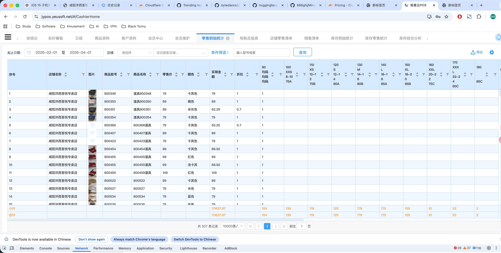 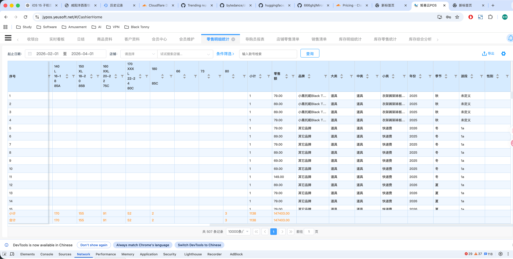

### 导购员报表

```bash
curl 'https://erpapistaging.yeusoft.net/eposapi/YisEposPerson/SelPersonSale' \
  -H 'accept: application/json, text/plain, */*' \
  -H 'accept-language: zh-CN,zh;q=0.9' \
  -H 'content-type: application/json;charset=UTF-8' \
  -H 'origin: https://jypos.yeusoft.net' \
  -H 'priority: u=1, i' \
  -H 'referer: https://jypos.yeusoft.net/' \
  -H 'sec-ch-ua: "Chromium";v="146", "Not-A.Brand";v="24", "Google Chrome";v="146"' \
  -H 'sec-ch-ua-mobile: ?0' \
  -H 'sec-ch-ua-platform: "macOS"' \
  -H 'sec-fetch-dest: empty' \
  -H 'sec-fetch-mode: cors' \
  -H 'sec-fetch-site: same-site' \
  -H 'token: <REDACTED_TOKEN>' \
  -H 'user-agent: Mozilla/5.0 (Macintosh; Intel Mac OS X 10_15_7) AppleWebKit/537.36 (KHTML, like Gecko) Chrome/146.0.0.0 Safari/537.36' \
  --data-raw '{"edate":"20260401","bdate":"20250301","name":"","page":1,"pagesize":20}'
```

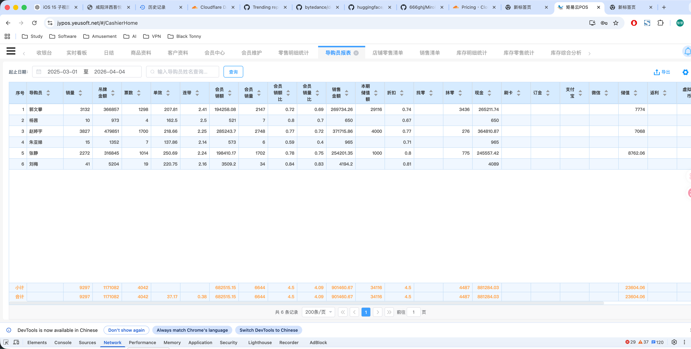

### 店铺零售清单

```bash
curl 'https://erpapistaging.yeusoft.net/FxErpApi/FXDIYReport/GetDIYReportData' \
  -H 'accept: application/json, text/plain, */*' \
  -H 'accept-language: zh-CN,zh;q=0.9' \
  -H 'content-type: application/json;charset=UTF-8' \
  -H 'origin: https://jypos.yeusoft.net' \
  -H 'priority: u=1, i' \
  -H 'referer: https://jypos.yeusoft.net/' \
  -H 'sec-ch-ua: "Chromium";v="146", "Not-A.Brand";v="24", "Google Chrome";v="146"' \
  -H 'sec-ch-ua-mobile: ?0' \
  -H 'sec-ch-ua-platform: "macOS"' \
  -H 'sec-fetch-dest: empty' \
  -H 'sec-fetch-mode: cors' \
  -H 'sec-fetch-site: same-site' \
  -H 'token: <REDACTED_TOKEN>' \
  -H 'user-agent: Mozilla/5.0 (Macintosh; Intel Mac OS X 10_15_7) AppleWebKit/537.36 (KHTML, like Gecko) Chrome/146.0.0.0 Safari/537.36' \
  --data-raw '{"menuid":"E004001007","gridid":"E004001007_main","parameter":{"WareClause":"","Depart":"  ","EndDate":"","BeginDate":"","Operater":"","Tiem":""}}'
```

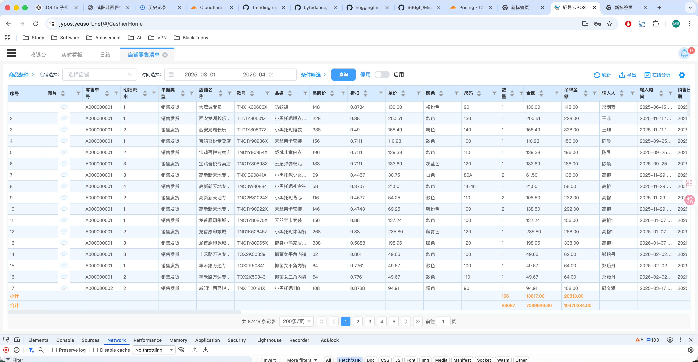 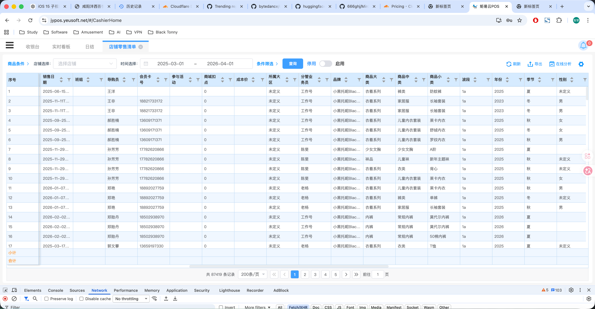
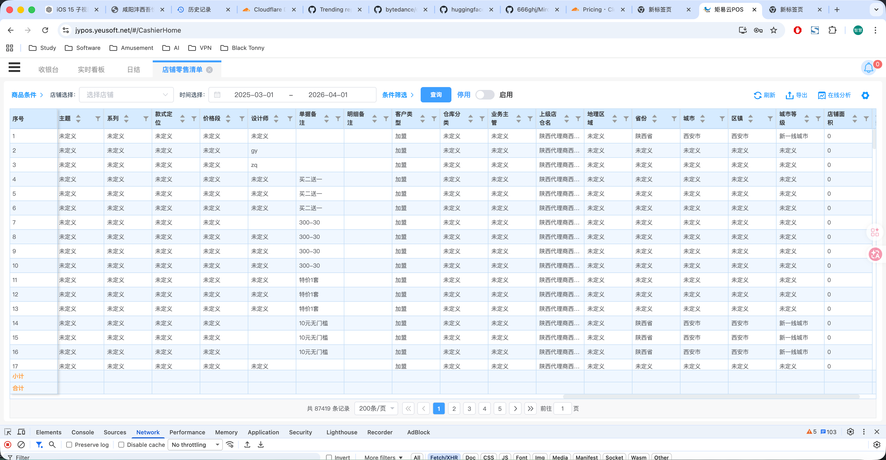 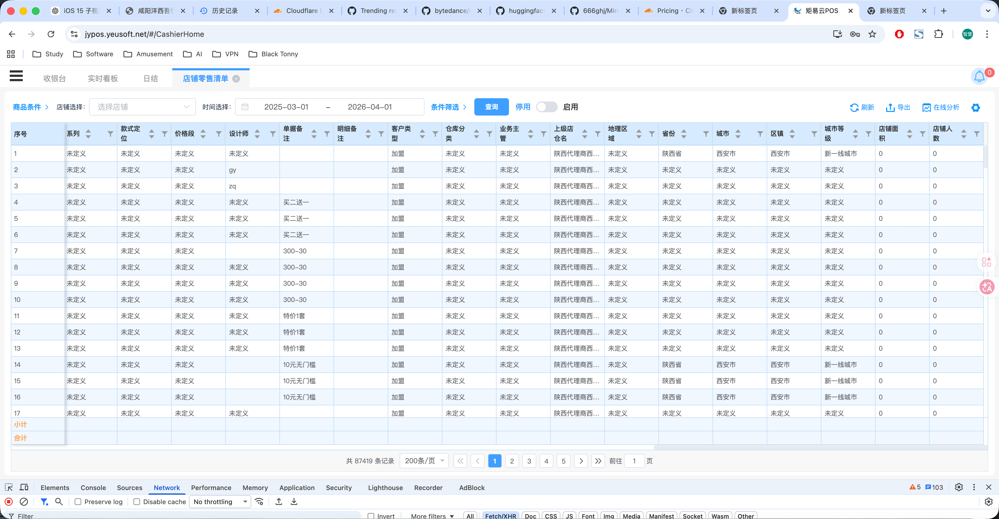

### 销售清单

```bash
curl 'https://erpapistaging.yeusoft.net/FxErpApi/FXDIYReport/GetDIYReportData' \
  -H 'accept: application/json, text/plain, */*' \
  -H 'accept-language: zh-CN,zh;q=0.9' \
  -H 'content-type: application/json;charset=UTF-8' \
  -H 'origin: https://jypos.yeusoft.net' \
  -H 'priority: u=1, i' \
  -H 'referer: https://jypos.yeusoft.net/' \
  -H 'sec-ch-ua: "Chromium";v="146", "Not-A.Brand";v="24", "Google Chrome";v="146"' \
  -H 'sec-ch-ua-mobile: ?0' \
  -H 'sec-ch-ua-platform: "macOS"' \
  -H 'sec-fetch-dest: empty' \
  -H 'sec-fetch-mode: cors' \
  -H 'sec-fetch-site: same-site' \
  -H 'token: <REDACTED_TOKEN>' \
  -H 'user-agent: Mozilla/5.0 (Macintosh; Intel Mac OS X 10_15_7) AppleWebKit/537.36 (KHTML, like Gecko) Chrome/146.0.0.0 Safari/537.36' \
  --data-raw $'{"menuid":"E004001008","gridid":"E004001008_2","parameter":{"BeginDate":"20250301","Depart":"\'A0190248\'","EndDate":"20260401","Operater":"","Tiem":"1","WareClause":""}}'
```

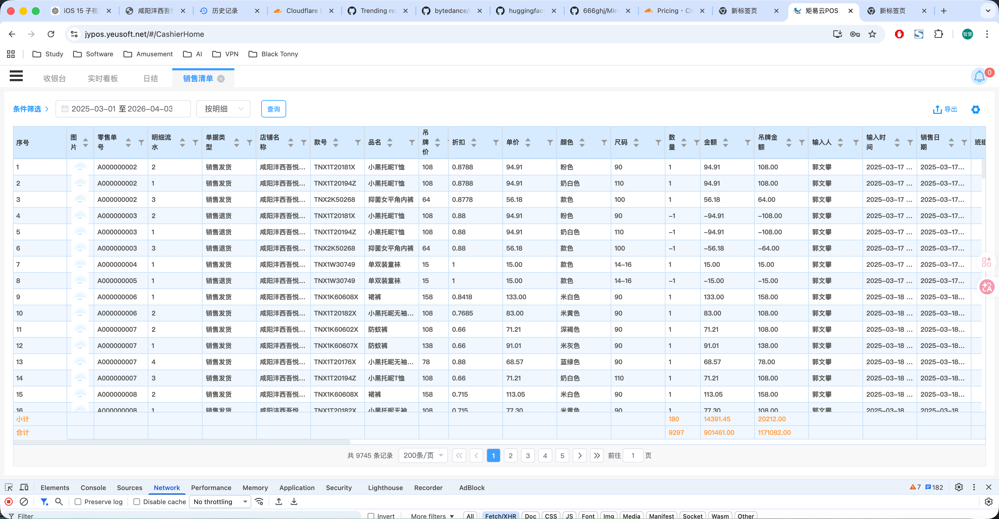 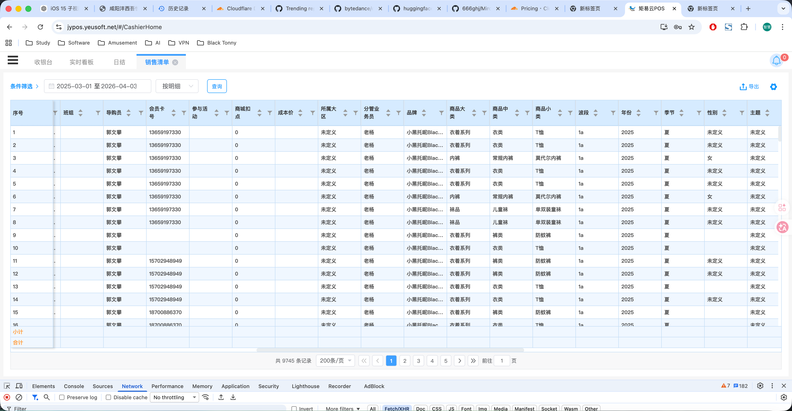
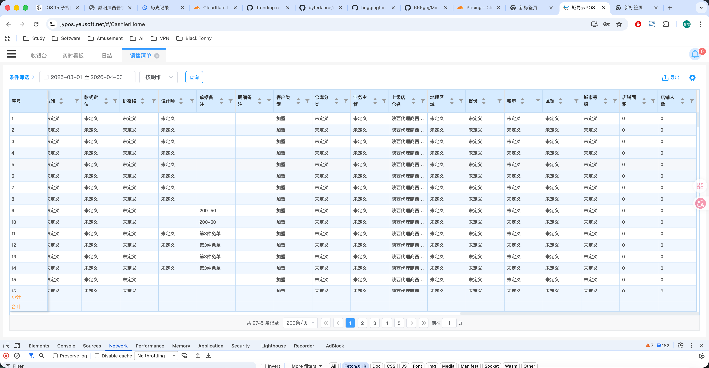

### 库存明细统计

```bash
curl 'https://erpapistaging.yeusoft.net/eposapi/YisEposReport/SelDeptStockWaitList' \
  -H 'accept: application/json, text/plain, */*' \
  -H 'accept-language: zh-CN,zh;q=0.9' \
  -H 'content-type: application/json;charset=UTF-8' \
  -H 'origin: https://jypos.yeusoft.net' \
  -H 'priority: u=1, i' \
  -H 'referer: https://jypos.yeusoft.net/' \
  -H 'sec-ch-ua: "Chromium";v="146", "Not-A.Brand";v="24", "Google Chrome";v="146"' \
  -H 'sec-ch-ua-mobile: ?0' \
  -H 'sec-ch-ua-platform: "macOS"' \
  -H 'sec-fetch-dest: empty' \
  -H 'sec-fetch-mode: cors' \
  -H 'sec-fetch-site: same-site' \
  -H 'token: <REDACTED_TOKEN>' \
  -H 'user-agent: Mozilla/5.0 (Macintosh; Intel Mac OS X 10_15_7) AppleWebKit/537.36 (KHTML, like Gecko) Chrome/146.0.0.0 Safari/537.36' \
  --data-raw '{"edate":"20260401","bdate":"20250301","depts":"","spenum":"","warecause":"","stockflag":"0","page":0,"pagesize":20}'
```

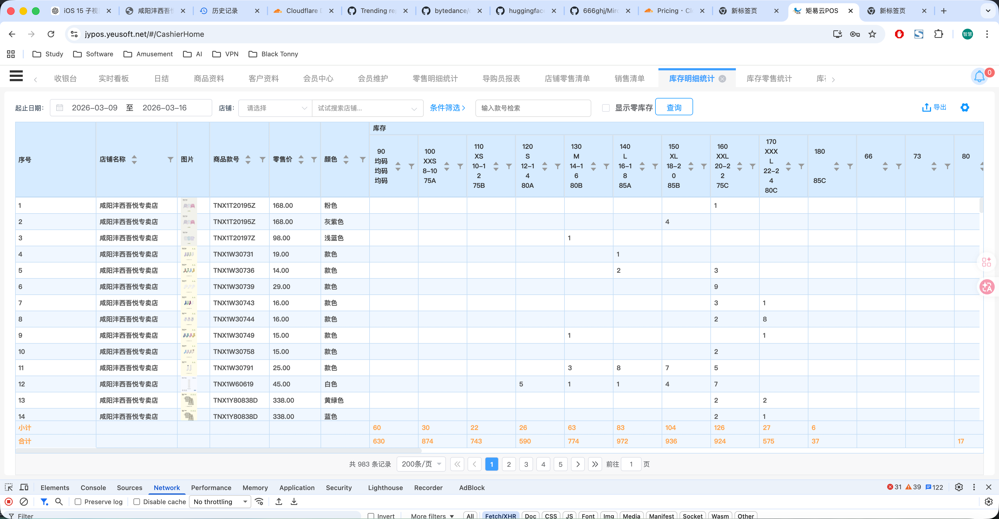 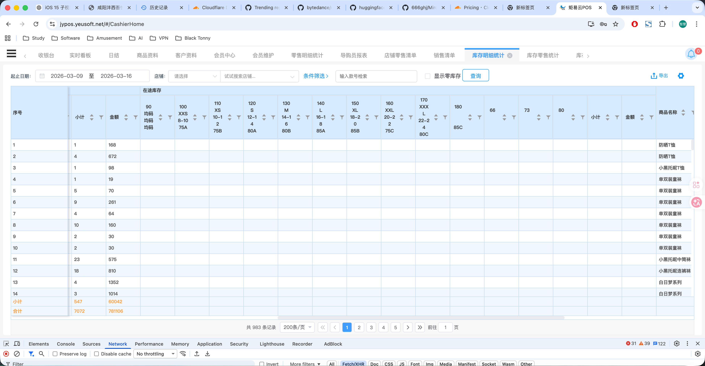
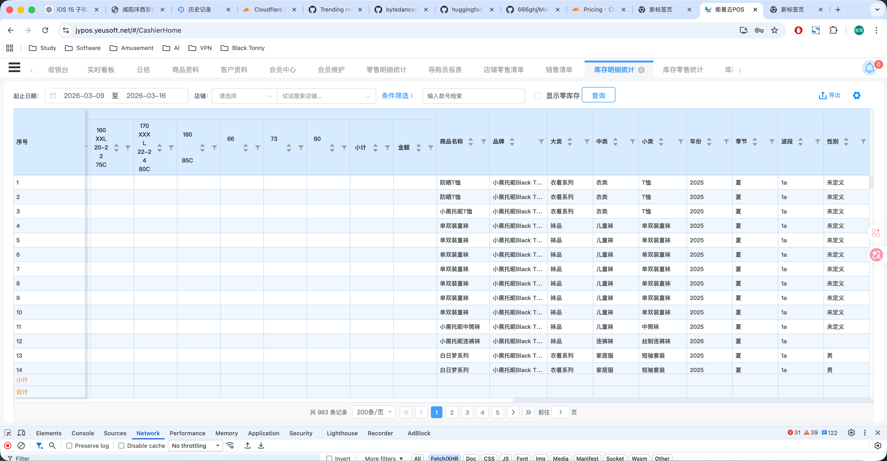

### 库存零售统计

```bash
curl 'https://erpapistaging.yeusoft.net/eposapi/YisEposReport/SelDeptStockSaleList' \
  -H 'accept: application/json, text/plain, */*' \
  -H 'accept-language: zh-CN,zh;q=0.9' \
  -H 'content-type: application/json;charset=UTF-8' \
  -H 'origin: https://jypos.yeusoft.net' \
  -H 'priority: u=1, i' \
  -H 'referer: https://jypos.yeusoft.net/' \
  -H 'sec-ch-ua: "Chromium";v="146", "Not-A.Brand";v="24", "Google Chrome";v="146"' \
  -H 'sec-ch-ua-mobile: ?0' \
  -H 'sec-ch-ua-platform: "macOS"' \
  -H 'sec-fetch-dest: empty' \
  -H 'sec-fetch-mode: cors' \
  -H 'sec-fetch-site: same-site' \
  -H 'token: <REDACTED_TOKEN>' \
  -H 'user-agent: Mozilla/5.0 (Macintosh; Intel Mac OS X 10_15_7) AppleWebKit/537.36 (KHTML, like Gecko) Chrome/146.0.0.0 Safari/537.36' \
  --data-raw '{"edate":"20260401","bdate":"20250301","depts":"","spenum":"","warecause":"","page":0,"pagesize":0}'
```

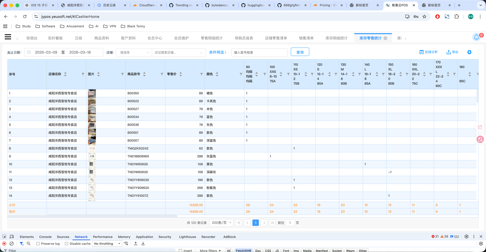 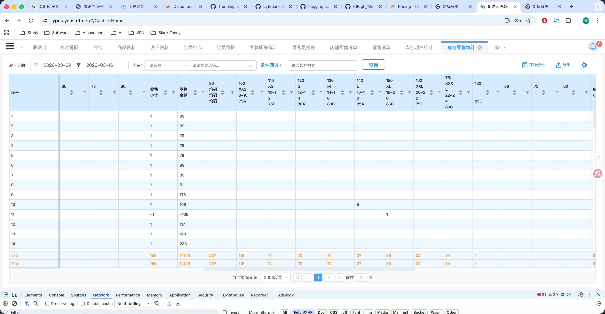
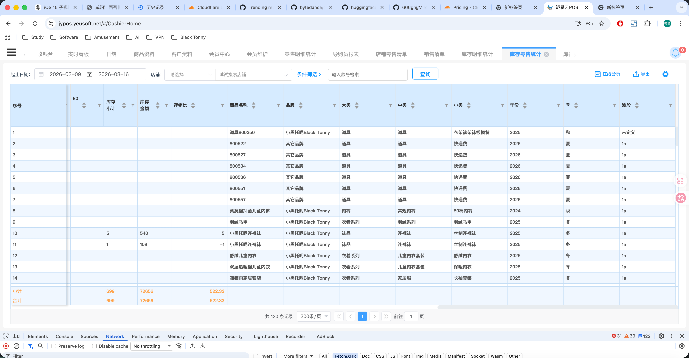

### 库存总和分析-按年份季节

```bash
curl 'https://erpapistaging.yeusoft.net/eposapi/YisEposReport/SelStockAnalysisList' \
  -H 'accept: application/json, text/plain, */*' \
  -H 'accept-language: zh-CN,zh;q=0.9' \
  -H 'content-type: application/json;charset=UTF-8' \
  -H 'origin: https://jypos.yeusoft.net' \
  -H 'priority: u=1, i' \
  -H 'referer: https://jypos.yeusoft.net/' \
  -H 'sec-ch-ua: "Chromium";v="146", "Not-A.Brand";v="24", "Google Chrome";v="146"' \
  -H 'sec-ch-ua-mobile: ?0' \
  -H 'sec-ch-ua-platform: "macOS"' \
  -H 'sec-fetch-dest: empty' \
  -H 'sec-fetch-mode: cors' \
  -H 'sec-fetch-site: same-site' \
  -H 'token: <REDACTED_TOKEN>' \
  -H 'user-agent: Mozilla/5.0 (Macintosh; Intel Mac OS X 10_15_7) AppleWebKit/537.36 (KHTML, like Gecko) Chrome/146.0.0.0 Safari/537.36' \
  --data-raw '{"rtype":1,"spenum":"","warecause":""}'
```

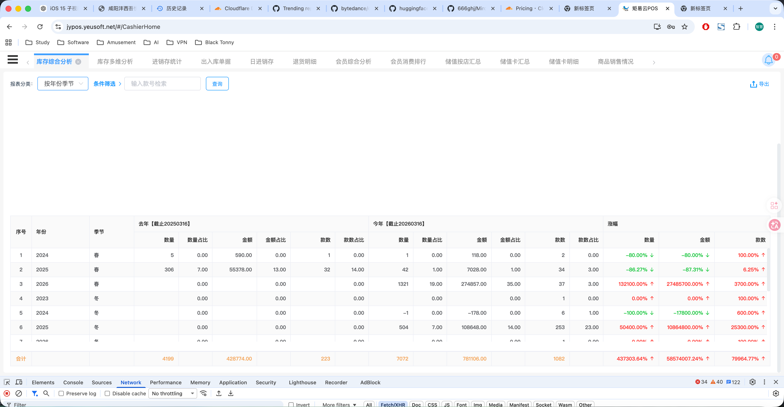

### 库存总和分析-按中分类

```bash
curl 'https://erpapistaging.yeusoft.net/eposapi/YisEposReport/SelStockAnalysisList' \
  -H 'accept: application/json, text/plain, */*' \
  -H 'accept-language: zh-CN,zh;q=0.9' \
  -H 'content-type: application/json;charset=UTF-8' \
  -H 'origin: https://jypos.yeusoft.net' \
  -H 'priority: u=1, i' \
  -H 'referer: https://jypos.yeusoft.net/' \
  -H 'sec-ch-ua: "Chromium";v="146", "Not-A.Brand";v="24", "Google Chrome";v="146"' \
  -H 'sec-ch-ua-mobile: ?0' \
  -H 'sec-ch-ua-platform: "macOS"' \
  -H 'sec-fetch-dest: empty' \
  -H 'sec-fetch-mode: cors' \
  -H 'sec-fetch-site: same-site' \
  -H 'token: <REDACTED_TOKEN>' \
  -H 'user-agent: Mozilla/5.0 (Macintosh; Intel Mac OS X 10_15_7) AppleWebKit/537.36 (KHTML, like Gecko) Chrome/146.0.0.0 Safari/537.36' \
  --data-raw '{"rtype":2,"spenum":"","warecause":""}'
```

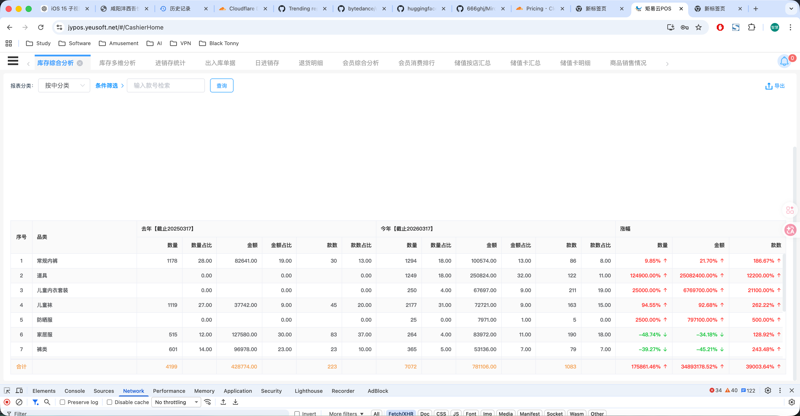

### 库存总和分析-按波段

```bash
curl 'https://erpapistaging.yeusoft.net/eposapi/YisEposReport/SelStockAnalysisList' \
  -H 'accept: application/json, text/plain, */*' \
  -H 'accept-language: zh-CN,zh;q=0.9' \
  -H 'content-type: application/json;charset=UTF-8' \
  -H 'origin: https://jypos.yeusoft.net' \
  -H 'priority: u=1, i' \
  -H 'referer: https://jypos.yeusoft.net/' \
  -H 'sec-ch-ua: "Chromium";v="146", "Not-A.Brand";v="24", "Google Chrome";v="146"' \
  -H 'sec-ch-ua-mobile: ?0' \
  -H 'sec-ch-ua-platform: "macOS"' \
  -H 'sec-fetch-dest: empty' \
  -H 'sec-fetch-mode: cors' \
  -H 'sec-fetch-site: same-site' \
  -H 'token: <REDACTED_TOKEN>' \
  -H 'user-agent: Mozilla/5.0 (Macintosh; Intel Mac OS X 10_15_7) AppleWebKit/537.36 (KHTML, like Gecko) Chrome/146.0.0.0 Safari/537.36' \
  --data-raw '{"rtype":3,"spenum":"","warecause":""}'
```

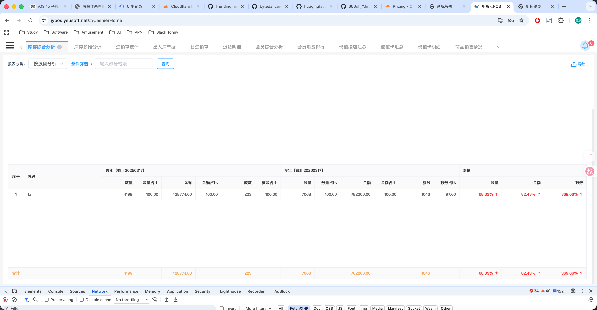

### 库存多维分析

```bash
curl 'https://erpapistaging.yeusoft.net/eposapi/YisEposReport/SelDeptStockAnalysis' \
  -H 'accept: application/json, text/plain, */*' \
  -H 'accept-language: zh-CN,zh;q=0.9' \
  -H 'content-type: application/json;charset=UTF-8' \
  -H 'origin: https://jypos.yeusoft.net' \
  -H 'priority: u=1, i' \
  -H 'referer: https://jypos.yeusoft.net/' \
  -H 'sec-ch-ua: "Chromium";v="146", "Not-A.Brand";v="24", "Google Chrome";v="146"' \
  -H 'sec-ch-ua-mobile: ?0' \
  -H 'sec-ch-ua-platform: "macOS"' \
  -H 'sec-fetch-dest: empty' \
  -H 'sec-fetch-mode: cors' \
  -H 'sec-fetch-site: same-site' \
  -H 'token: <REDACTED_TOKEN>' \
  -H 'user-agent: Mozilla/5.0 (Macintosh; Intel Mac OS X 10_15_7) AppleWebKit/537.36 (KHTML, like Gecko) Chrome/146.0.0.0 Safari/537.36' \
  --data-raw '{"bdate":"20250301","edate":"20260401","warecause":"","spenum":"","depts":"","stockflag":"0","page":0,"pagesize":0}'
```

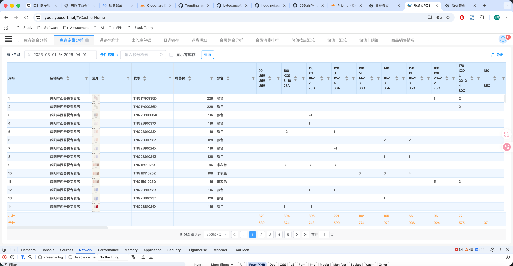 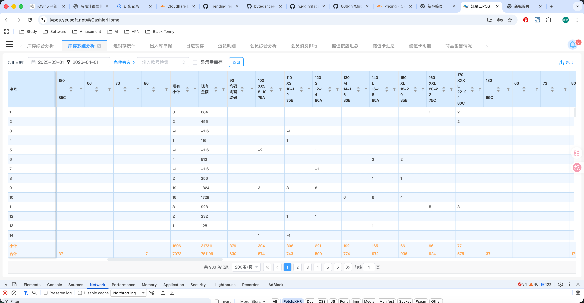
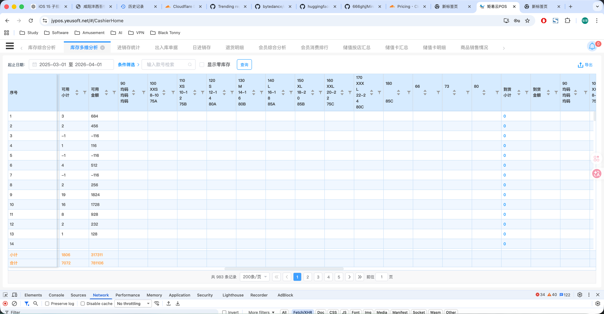 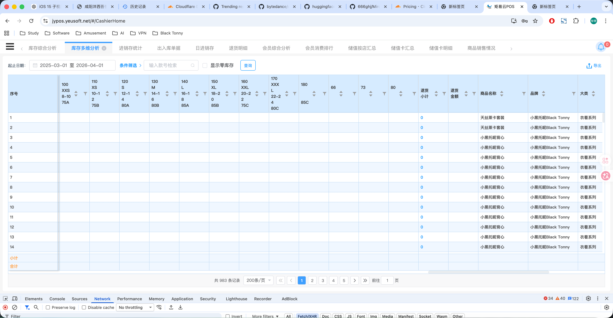
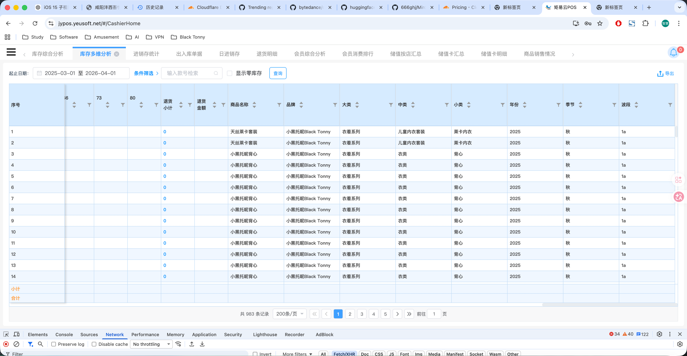

### 进销存统计

```bash
curl 'https://erpapistaging.yeusoft.net/eposapi/YisEposReport/SelInSalesReport' \
  -H 'accept: application/json, text/plain, */*' \
  -H 'accept-language: zh-CN,zh;q=0.9' \
  -H 'content-type: application/json;charset=UTF-8' \
  -H 'origin: https://jypos.yeusoft.net' \
  -H 'priority: u=1, i' \
  -H 'referer: https://jypos.yeusoft.net/' \
  -H 'sec-ch-ua: "Chromium";v="146", "Not-A.Brand";v="24", "Google Chrome";v="146"' \
  -H 'sec-ch-ua-mobile: ?0' \
  -H 'sec-ch-ua-platform: "macOS"' \
  -H 'sec-fetch-dest: empty' \
  -H 'sec-fetch-mode: cors' \
  -H 'sec-fetch-site: same-site' \
  -H 'token: <REDACTED_TOKEN>' \
  -H 'user-agent: Mozilla/5.0 (Macintosh; Intel Mac OS X 10_15_7) AppleWebKit/537.36 (KHTML, like Gecko) Chrome/146.0.0.0 Safari/537.36' \
  --data-raw '{"edate":"20260401","bdate":"20260401","sort":"","spenum":"","warecause":"","page":0,"pagesize":0}'
```

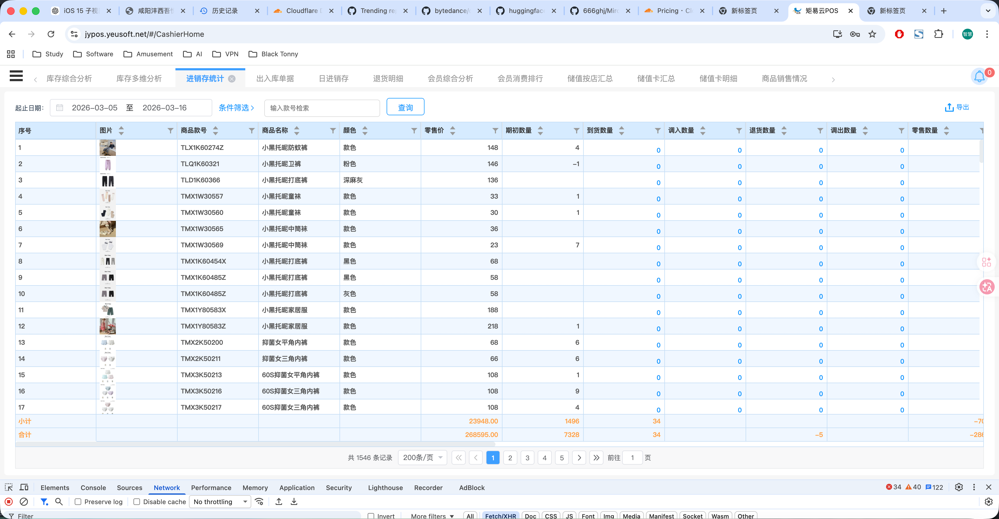 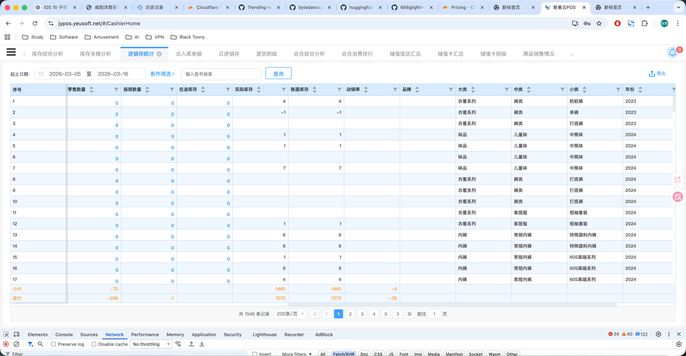
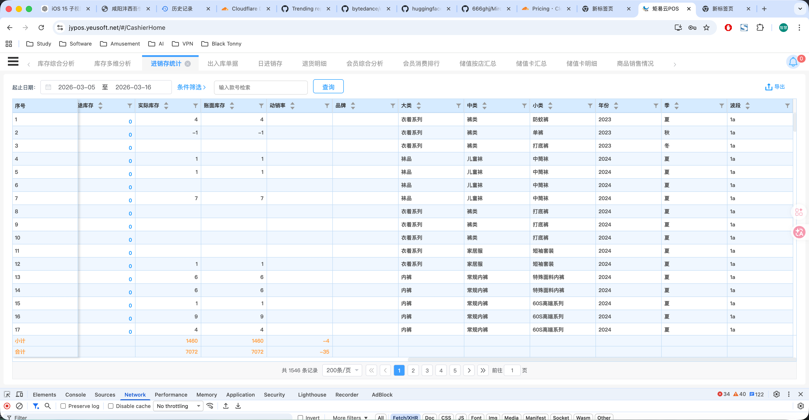

### 出入库单据

```bash
curl 'https://erpapistaging.yeusoft.net/eposapi/YisEposReport/SelOutInStockReport' \
  -H 'accept: application/json, text/plain, */*' \
  -H 'accept-language: zh-CN,zh;q=0.9' \
  -H 'content-type: application/json;charset=UTF-8' \
  -H 'origin: https://jypos.yeusoft.net' \
  -H 'priority: u=1, i' \
  -H 'referer: https://jypos.yeusoft.net/' \
  -H 'sec-ch-ua: "Chromium";v="146", "Not-A.Brand";v="24", "Google Chrome";v="146"' \
  -H 'sec-ch-ua-mobile: ?0' \
  -H 'sec-ch-ua-platform: "macOS"' \
  -H 'sec-fetch-dest: empty' \
  -H 'sec-fetch-mode: cors' \
  -H 'sec-fetch-site: same-site' \
  -H 'token: <REDACTED_TOKEN>' \
  -H 'user-agent: Mozilla/5.0 (Macintosh; Intel Mac OS X 10_15_7) AppleWebKit/537.36 (KHTML, like Gecko) Chrome/146.0.0.0 Safari/537.36' \
  --data-raw '{"edate":"20260401","bdate":"20250301","datetype":"1","type":"已出库,已入库,在途","spenum":"","doctype":"1,2,3,4,5,6,7","warecause":"","page":0,"pagesize":0}'
```

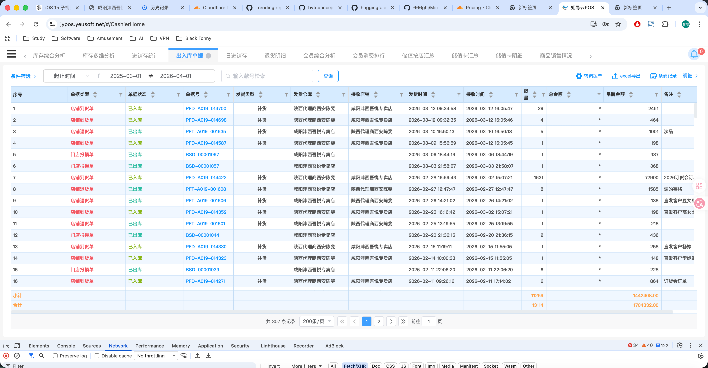

### 日进销存

```bash
curl 'https://erpapistaging.yeusoft.net/eposapi/YisEposReport/SelInSalesReportByDay' \
  -H 'sec-ch-ua-platform: "macOS"' \
  -H 'Referer: https://jypos.yeusoft.net/' \
  -H 'sec-ch-ua: "Chromium";v="146", "Not-A.Brand";v="24", "Google Chrome";v="146"' \
  -H 'sec-ch-ua-mobile: ?0' \
  -H 'User-Agent: Mozilla/5.0 (Macintosh; Intel Mac OS X 10_15_7) AppleWebKit/537.36 (KHTML, like Gecko) Chrome/146.0.0.0 Safari/537.36' \
  -H 'Accept: application/json, text/plain, */*' \
  -H 'Content-Type: application/json;charset=UTF-8' \
  -H 'token: <REDACTED_TOKEN>' \
  --data-raw '{"bdate":"20250301","edate":"20260401","warecause":"","spenum":"","page":0,"pagesize":0}'
```

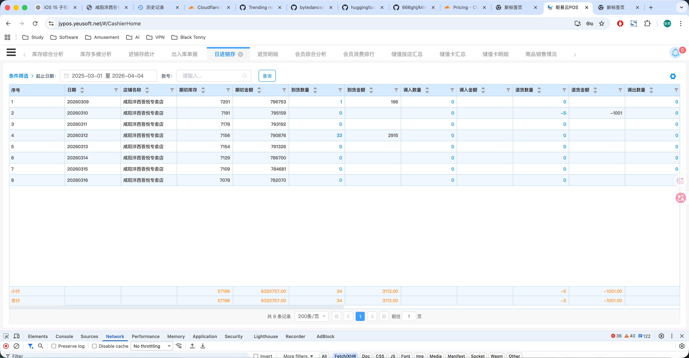

### 会员总和分析

```bash
curl 'https://erpapistaging.yeusoft.net/eposapi/YisEposReport/SelVipAnalysisReport' \
  -H 'accept: application/json, text/plain, */*' \
  -H 'accept-language: zh-CN,zh;q=0.9' \
  -H 'content-type: application/json;charset=UTF-8' \
  -H 'origin: https://jypos.yeusoft.net' \
  -H 'priority: u=1, i' \
  -H 'referer: https://jypos.yeusoft.net/' \
  -H 'sec-ch-ua: "Chromium";v="146", "Not-A.Brand";v="24", "Google Chrome";v="146"' \
  -H 'sec-ch-ua-mobile: ?0' \
  -H 'sec-ch-ua-platform: "macOS"' \
  -H 'sec-fetch-dest: empty' \
  -H 'sec-fetch-mode: cors' \
  -H 'sec-fetch-site: same-site' \
  -H 'token: <REDACTED_TOKEN>' \
  -H 'user-agent: Mozilla/5.0 (Macintosh; Intel Mac OS X 10_15_7) AppleWebKit/537.36 (KHTML, like Gecko) Chrome/146.0.0.0 Safari/537.36' \
  --data-raw '{"salebdate":"20250301","saleedate":"20250401","birthbdate":"","birthedate":"","page":0,"pagesize":0,"salemoney1":"0","salemoney2":"0","tag":"","type":""}'
```

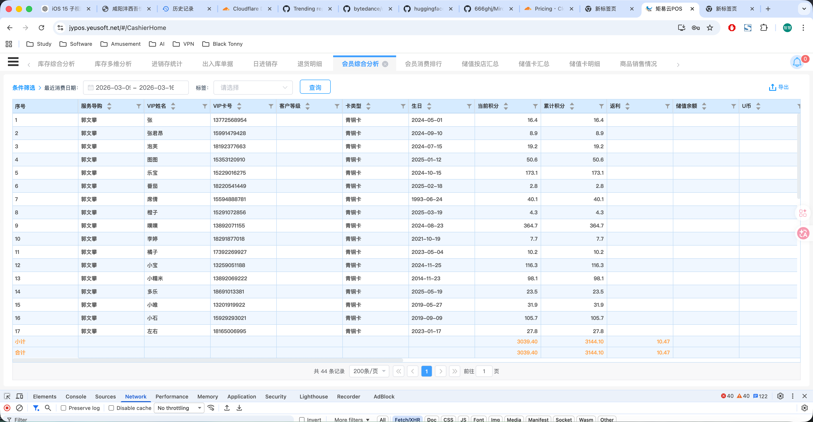

### 会员消费排行

```bash
curl 'https://erpapistaging.yeusoft.net/eposapi/YisEposReport/SelVipSaleRank' \
  -H 'accept: application/json, text/plain, */*' \
  -H 'accept-language: zh-CN,zh;q=0.9' \
  -H 'content-type: application/json;charset=UTF-8' \
  -H 'origin: https://jypos.yeusoft.net' \
  -H 'priority: u=1, i' \
  -H 'referer: https://jypos.yeusoft.net/' \
  -H 'sec-ch-ua: "Chromium";v="146", "Not-A.Brand";v="24", "Google Chrome";v="146"' \
  -H 'sec-ch-ua-mobile: ?0' \
  -H 'sec-ch-ua-platform: "macOS"' \
  -H 'sec-fetch-dest: empty' \
  -H 'sec-fetch-mode: cors' \
  -H 'sec-fetch-site: same-site' \
  -H 'token: <REDACTED_TOKEN>' \
  -H 'user-agent: Mozilla/5.0 (Macintosh; Intel Mac OS X 10_15_7) AppleWebKit/537.36 (KHTML, like Gecko) Chrome/146.0.0.0 Safari/537.36' \
  --data-raw '{"bdate":"20250301","edate":"20260401","page":0,"pagesize":0}'
```

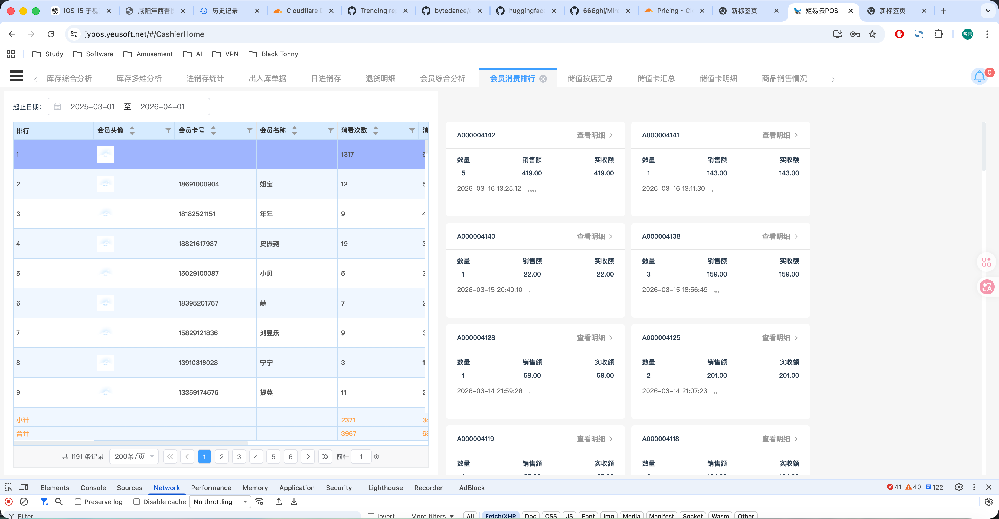 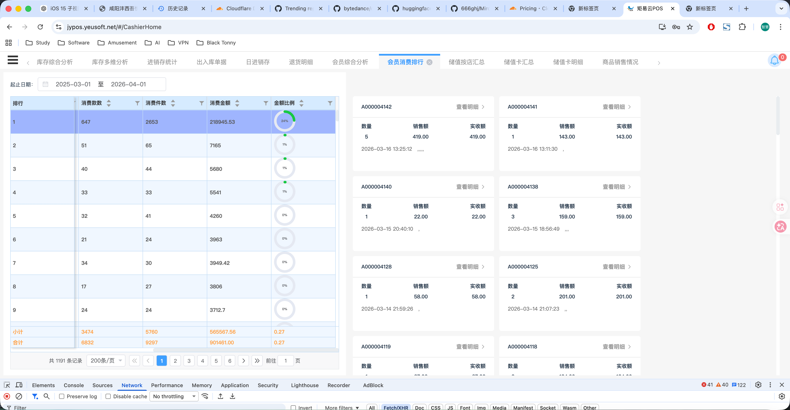

### 储值按店汇总

```bash
curl 'https://erpapistaging.yeusoft.net/FxErpApi/FXDIYReport/GetDIYReportData' \
  -H 'accept: application/json, text/plain, */*' \
  -H 'accept-language: zh-CN,zh;q=0.9' \
  -H 'content-type: application/json;charset=UTF-8' \
  -H 'origin: https://jypos.yeusoft.net' \
  -H 'priority: u=1, i' \
  -H 'referer: https://jypos.yeusoft.net/' \
  -H 'sec-ch-ua: "Chromium";v="146", "Not-A.Brand";v="24", "Google Chrome";v="146"' \
  -H 'sec-ch-ua-mobile: ?0' \
  -H 'sec-ch-ua-platform: "macOS"' \
  -H 'sec-fetch-dest: empty' \
  -H 'sec-fetch-mode: cors' \
  -H 'sec-fetch-site: same-site' \
  -H 'token: <REDACTED_TOKEN>' \
  -H 'user-agent: Mozilla/5.0 (Macintosh; Intel Mac OS X 10_15_7) AppleWebKit/537.36 (KHTML, like Gecko) Chrome/146.0.0.0 Safari/537.36' \
  --data-raw '{"menuid":"E004004003","gridid":"E004004003_main","parameter":{"EndDate":"2026-04-01","BeginDate":"2025-03-01"}}'
```

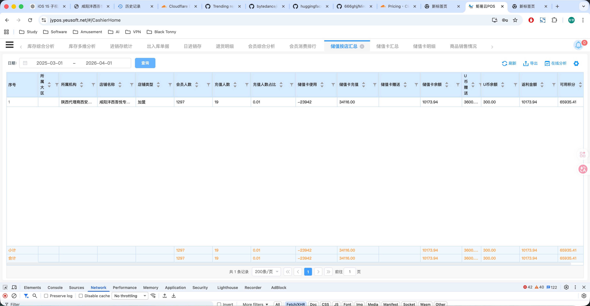

### 储值卡汇总

```bash
curl 'https://erpapistaging.yeusoft.net/FxErpApi/FXDIYReport/GetDIYReportData' \
  -H 'accept: application/json, text/plain, */*' \
  -H 'accept-language: zh-CN,zh;q=0.9' \
  -H 'content-type: application/json;charset=UTF-8' \
  -H 'origin: https://jypos.yeusoft.net' \
  -H 'priority: u=1, i' \
  -H 'referer: https://jypos.yeusoft.net/' \
  -H 'sec-ch-ua: "Chromium";v="146", "Not-A.Brand";v="24", "Google Chrome";v="146"' \
  -H 'sec-ch-ua-mobile: ?0' \
  -H 'sec-ch-ua-platform: "macOS"' \
  -H 'sec-fetch-dest: empty' \
  -H 'sec-fetch-mode: cors' \
  -H 'sec-fetch-site: same-site' \
  -H 'token: <REDACTED_TOKEN>' \
  -H 'user-agent: Mozilla/5.0 (Macintosh; Intel Mac OS X 10_15_7) AppleWebKit/537.36 (KHTML, like Gecko) Chrome/146.0.0.0 Safari/537.36' \
  --data-raw '{"menuid":"E004004004","gridid":"E004004004_main","parameter":{"EndDate":"2026-04-01","BeginDate":"2025-03-01","Search":""}}'
```

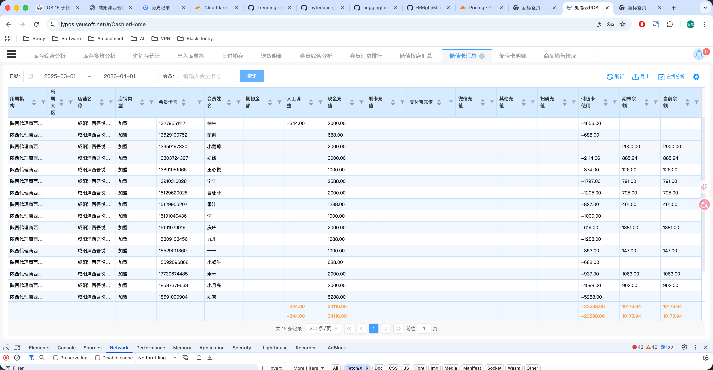

### 储值卡明细

```bash
curl 'https://erpapistaging.yeusoft.net/FxErpApi/FXDIYReport/GetDIYReportData' \
  -H 'accept: application/json, text/plain, */*' \
  -H 'accept-language: zh-CN,zh;q=0.9' \
  -H 'content-type: application/json;charset=UTF-8' \
  -H 'origin: https://jypos.yeusoft.net' \
  -H 'priority: u=1, i' \
  -H 'referer: https://jypos.yeusoft.net/' \
  -H 'sec-ch-ua: "Chromium";v="146", "Not-A.Brand";v="24", "Google Chrome";v="146"' \
  -H 'sec-ch-ua-mobile: ?0' \
  -H 'sec-ch-ua-platform: "macOS"' \
  -H 'sec-fetch-dest: empty' \
  -H 'sec-fetch-mode: cors' \
  -H 'sec-fetch-site: same-site' \
  -H 'token: <REDACTED_TOKEN>' \
  -H 'user-agent: Mozilla/5.0 (Macintosh; Intel Mac OS X 10_15_7) AppleWebKit/537.36 (KHTML, like Gecko) Chrome/146.0.0.0 Safari/537.36' \
  --data-raw '{"menuid":"E004004005","gridid":"E004004005_main","parameter":{"EndDate":"2026-04-01","BeginDate":"2025-03-01","Search":""}}'
```

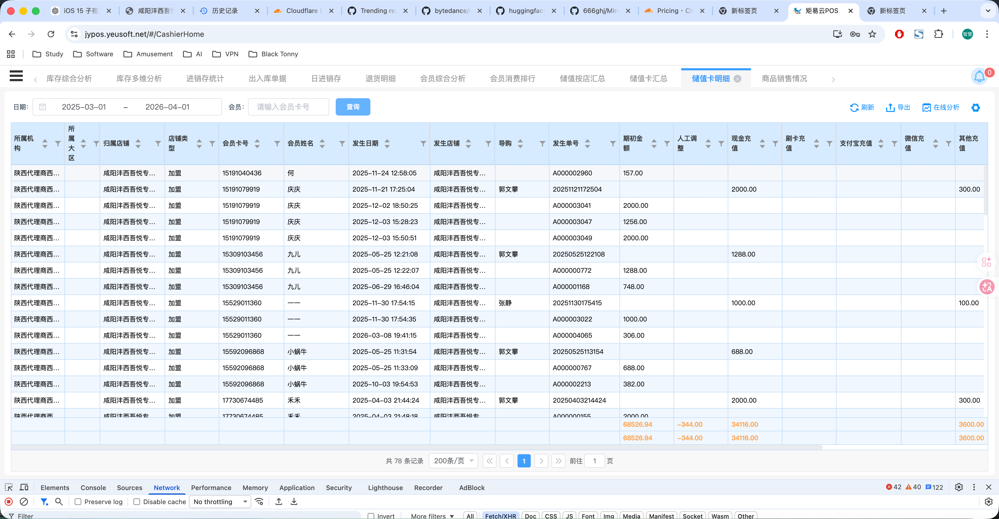 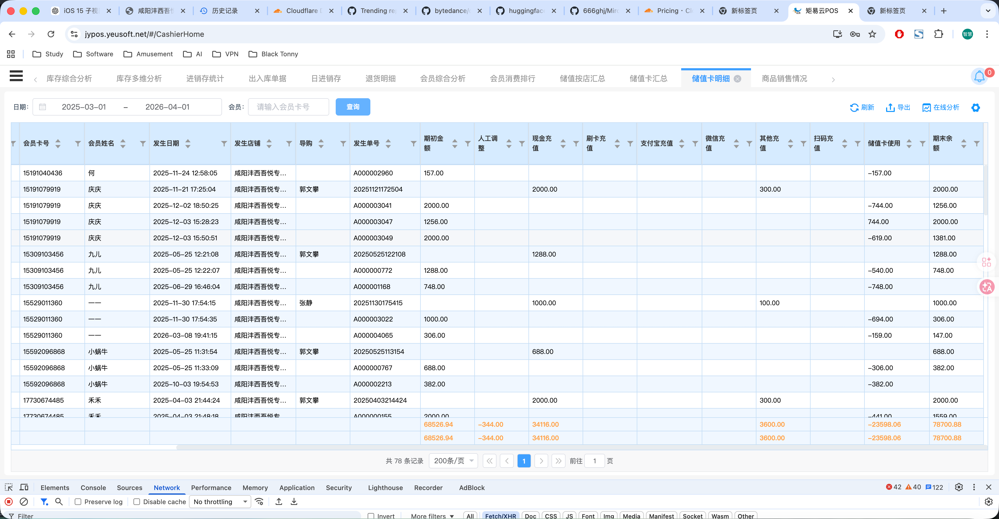

### 商品销售情况

```bash
curl 'https://erpapistaging.yeusoft.net/eposapi/YisEposReport/SelSaleReportData' \
  -H 'accept: application/json, text/plain, */*' \
  -H 'accept-language: zh-CN,zh;q=0.9' \
  -H 'content-type: application/json;charset=UTF-8' \
  -H 'origin: https://jypos.yeusoft.net' \
  -H 'priority: u=1, i' \
  -H 'referer: https://jypos.yeusoft.net/' \
  -H 'sec-ch-ua: "Chromium";v="146", "Not-A.Brand";v="24", "Google Chrome";v="146"' \
  -H 'sec-ch-ua-mobile: ?0' \
  -H 'sec-ch-ua-platform: "macOS"' \
  -H 'sec-fetch-dest: empty' \
  -H 'sec-fetch-mode: cors' \
  -H 'sec-fetch-site: same-site' \
  -H 'token: <REDACTED_TOKEN>' \
  -H 'user-agent: Mozilla/5.0 (Macintosh; Intel Mac OS X 10_15_7) AppleWebKit/537.36 (KHTML, like Gecko) Chrome/146.0.0.0 Safari/537.36' \
  --data-raw '{"edate":"20260401","bdate":"20250301","warecause":"","spenum":""}'
```

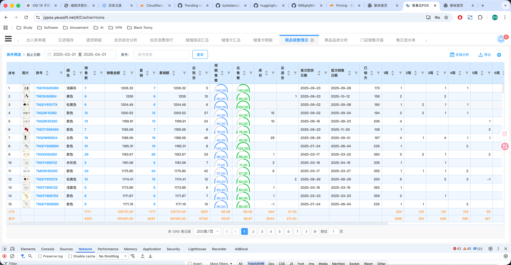 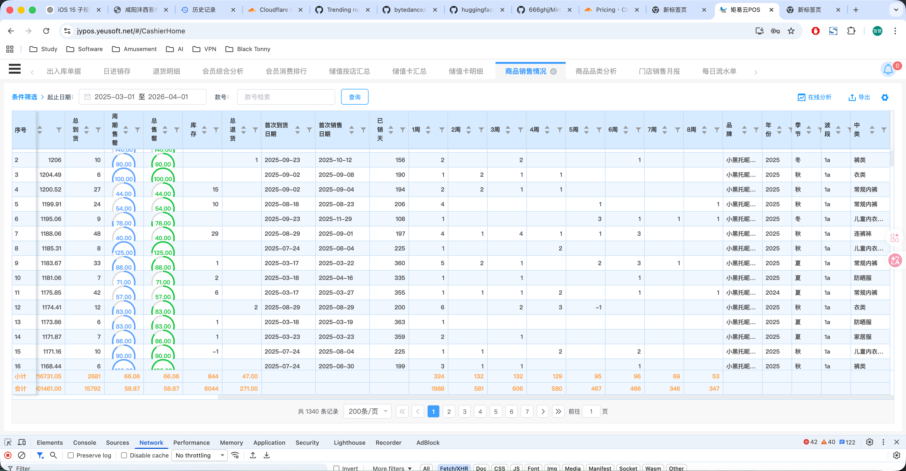

### 商品品类分析

```bash
curl 'https://erpapistaging.yeusoft.net/eposapi/YisEposWareTypeAnalysis/SelWareTypeAnalysisList' \
  -H 'accept: application/json, text/plain, */*' \
  -H 'accept-language: zh-CN,zh;q=0.9' \
  -H 'content-type: application/json;charset=UTF-8' \
  -H 'origin: https://jypos.yeusoft.net' \
  -H 'priority: u=1, i' \
  -H 'referer: https://jypos.yeusoft.net/' \
  -H 'sec-ch-ua: "Chromium";v="146", "Not-A.Brand";v="24", "Google Chrome";v="146"' \
  -H 'sec-ch-ua-mobile: ?0' \
  -H 'sec-ch-ua-platform: "macOS"' \
  -H 'sec-fetch-dest: empty' \
  -H 'sec-fetch-mode: cors' \
  -H 'sec-fetch-site: same-site' \
  -H 'token: <REDACTED_TOKEN>' \
  -H 'user-agent: Mozilla/5.0 (Macintosh; Intel Mac OS X 10_15_7) AppleWebKit/537.36 (KHTML, like Gecko) Chrome/146.0.0.0 Safari/537.36' \
  --data-raw $'{"menuid":"E004005002","gridid":"E004005002_1","warecause":"AND Years IN  (\'2026\')","type":3,"bdate":"20250301","edate":"20260401"}'
```

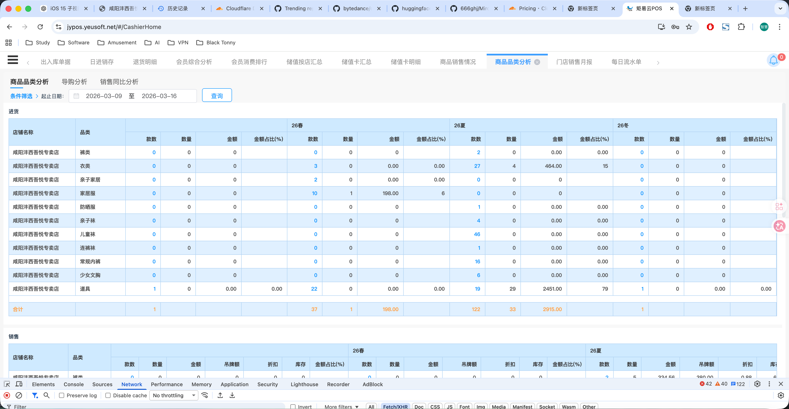 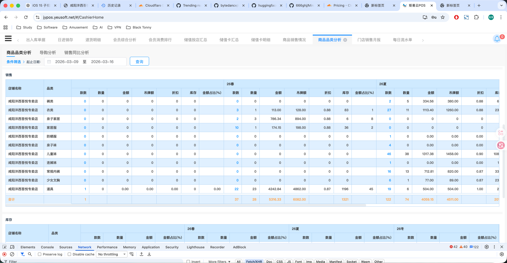
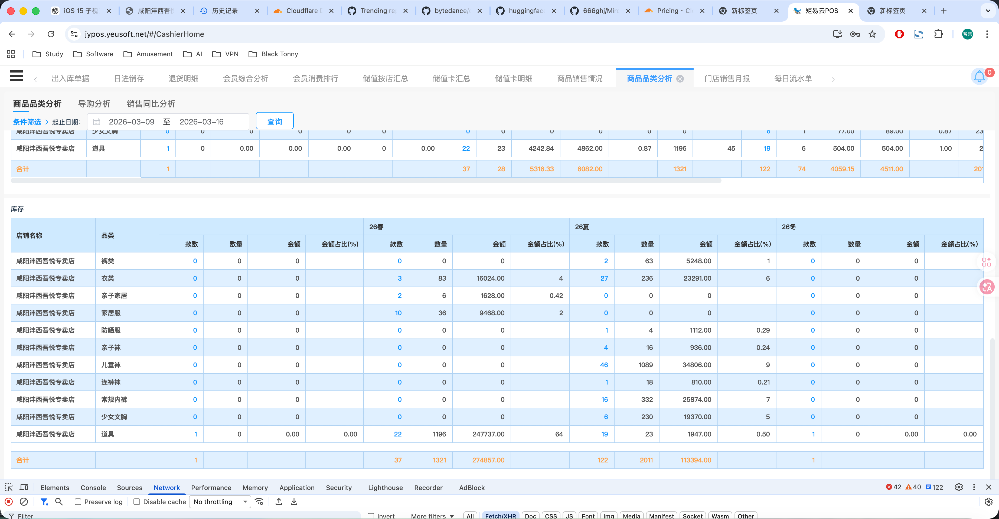

### 门店销售月报

```bash
curl 'https://jyapistaging.yeusoft.net/JyApi/DeptMonthSalesReport/DeptMonthSalesReport' \
  -H 'accept: application/json, text/plain, */*' \
  -H 'accept-language: zh-CN,zh;q=0.9' \
  -H 'authorization: Bearer <REDACTED_TOKEN>' \
  -H 'content-type: application/json;charset=UTF-8' \
  -H 'origin: https://jypos.yeusoft.net' \
  -H 'priority: u=1, i' \
  -H 'referer: https://jypos.yeusoft.net/' \
  -H 'sec-ch-ua: "Chromium";v="146", "Not-A.Brand";v="24", "Google Chrome";v="146"' \
  -H 'sec-ch-ua-mobile: ?0' \
  -H 'sec-ch-ua-platform: "macOS"' \
  -H 'sec-fetch-dest: empty' \
  -H 'sec-fetch-mode: cors' \
  -H 'sec-fetch-site: same-site' \
  -H 'user-agent: Mozilla/5.0 (Macintosh; Intel Mac OS X 10_15_7) AppleWebKit/537.36 (KHTML, like Gecko) Chrome/146.0.0.0 Safari/537.36' \
  --data-raw '{"Type":"1","BeginDate":"2025-02-01","EndDate":"2026-03-14","YBeginDate":"2024-02-01","YEndDate":"2025-03-14","MBeginDate":"2023-12-23","MEndDate":"2025-02-01","PageIndex":1,"PageSize":20}'
```

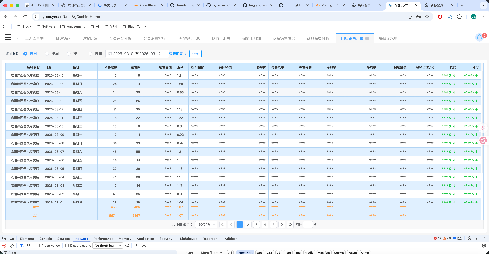

### 每日流水单

```bash
curl 'https://jyapistaging.yeusoft.net/JyApi/ReconciliationAnalysis/SelectRetailDocPaymentSlip' \
  -H 'accept: application/json, text/plain, */*' \
  -H 'accept-language: zh-CN,zh;q=0.9' \
  -H 'authorization: Bearer <REDACTED_TOKEN>' \
  -H 'content-type: application/json;charset=UTF-8' \
  -H 'origin: https://jypos.yeusoft.net' \
  -H 'priority: u=1, i' \
  -H 'referer: https://jypos.yeusoft.net/' \
  -H 'sec-ch-ua: "Chromium";v="146", "Not-A.Brand";v="24", "Google Chrome";v="146"' \
  -H 'sec-ch-ua-mobile: ?0' \
  -H 'sec-ch-ua-platform: "macOS"' \
  -H 'sec-fetch-dest: empty' \
  -H 'sec-fetch-mode: cors' \
  -H 'sec-fetch-site: same-site' \
  -H 'user-agent: Mozilla/5.0 (Macintosh; Intel Mac OS X 10_15_7) AppleWebKit/537.36 (KHTML, like Gecko) Chrome/146.0.0.0 Safari/537.36' \
  --data-raw '{"MenuID":"E004006001","SearchType":"1","Search":"","LastDate":"","BeginDate":"2025-03-01","EndDate":"2026-04-01"}'
```

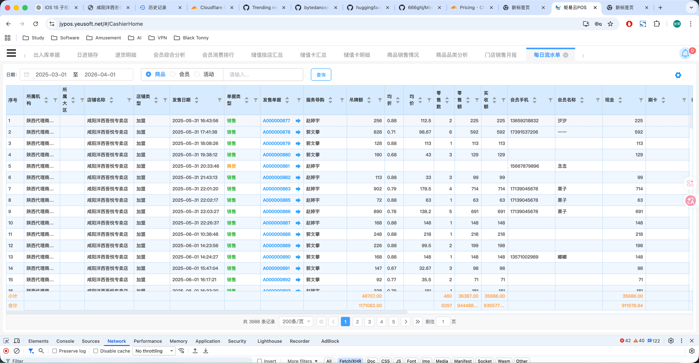 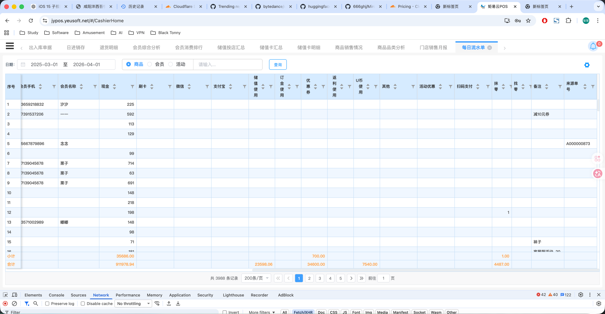

### 会员中心

```bash
curl 'https://erpapistaging.yeusoft.net/eposapi/YisEposVipManage/SelVipInfoList' \
  -H 'accept: application/json, text/plain, */*' \
  -H 'accept-language: zh-CN,zh;q=0.9' \
  -H 'content-type: application/json;charset=UTF-8' \
  -H 'origin: https://jypos.yeusoft.net' \
  -H 'priority: u=1, i' \
  -H 'referer: https://jypos.yeusoft.net/' \
  -H 'sec-ch-ua: "Chromium";v="146", "Not-A.Brand";v="24", "Google Chrome";v="146"' \
  -H 'sec-ch-ua-mobile: ?0' \
  -H 'sec-ch-ua-platform: "macOS"' \
  -H 'sec-fetch-dest: empty' \
  -H 'sec-fetch-mode: cors' \
  -H 'sec-fetch-site: same-site' \
  -H 'token: <REDACTED_TOKEN>' \
  -H 'user-agent: Mozilla/5.0 (Macintosh; Intel Mac OS X 10_15_7) AppleWebKit/537.36 (KHTML, like Gecko) Chrome/146.0.0.0 Safari/537.36' \
  --data-raw '{"condition":"","searchval":"","VolumeNumber":""}'
```

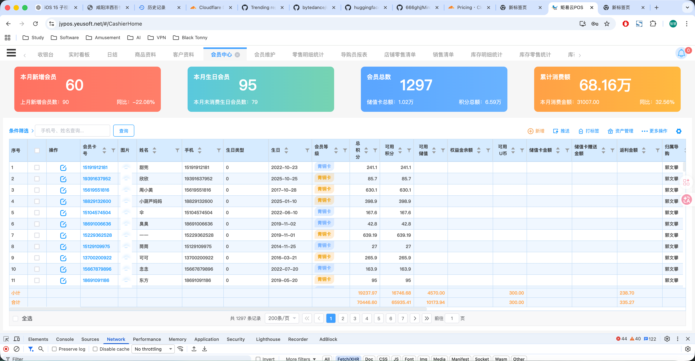 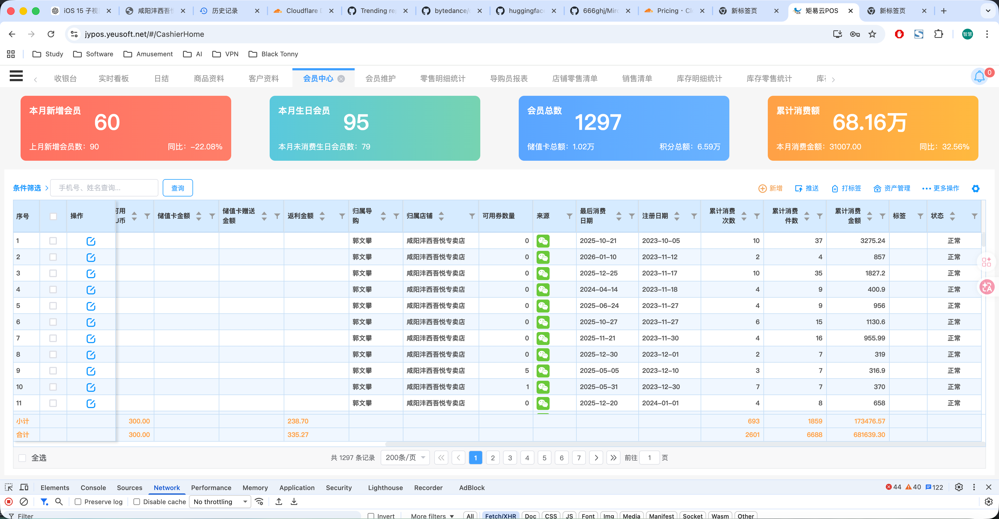

## 底部待补图片

当前无未归位图片。
